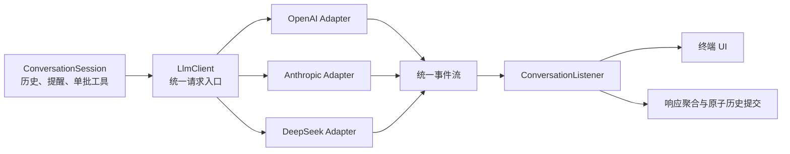
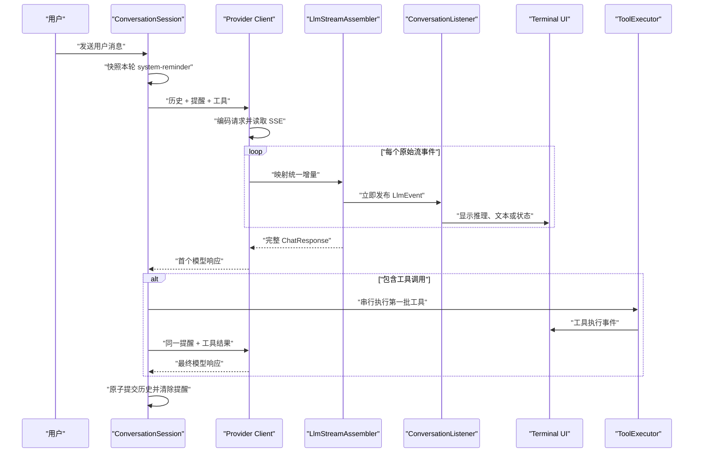
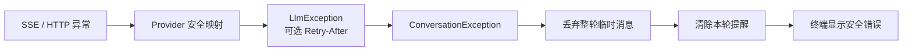

# 第二章：LLM API 与终端多轮对话 Plan

## 架构概览

系统采用“终端层 → 会话应用层 → LLM 抽象层 → 厂商适配层”的单向分层架构。

### 1. 启动与配置层

负责读取并校验环境变量，根据 `provider` 创建对应的 LLM 客户端。配置无效时直接输出脱敏错误并终止启动。

统一配置项包括：

- `IMIO_PROVIDER`：`openai`、`anthropic` 或 `deepseek`
- `IMIO_MODEL`：当前模型名称
- 对应厂商的 API Key 环境变量
- 对应厂商的可选 Base URL 环境变量
- 可选连接超时和请求超时
- 可选最大输出 Token 数，默认 `4096`

### 2. 终端交互层

使用 JLine 实现滚动式终端交互，负责显示用户输入提示、读取 UTF-8 文本、忽略空白输入、识别 `/exit` 和 `/quit`、实时显示模型文本片段、显示脱敏错误，以及捕获 Ctrl+C 并结束程序。

终端层只负责输入和展示，不直接调用厂商 API，也不维护对话历史。

### 3. 会话应用层

负责一轮对话的完整编排：

1. 接收有效用户输入。
2. 将用户消息与已有历史组成待发送请求。
3. 调用当前 LLM 客户端。
4. 将文本片段逐个转发给终端。
5. 响应完整结束后，原子性地提交用户消息和完整模型回复。
6. 请求失败或流中断时，丢弃本轮暂存内容。
7. 返回终端输入状态。

会话历史仅存在于当前进程内。

### 4. LLM 抽象层

定义统一的流式对话接口、消息模型、流事件和错误类型。应用层只依赖该抽象，不感知厂商的 URL、请求 JSON、认证头或 SSE 事件格式。

### 5. 厂商适配层

- OpenAI：调用 Responses API，解析流式文本增量和完成事件。
- Anthropic：调用 Messages API，解析内容块增量和消息完成事件。
- DeepSeek：调用 Chat Completions API，解析流式 `delta.content` 和结束标记。

每个适配器负责构造厂商原生请求、设置认证头和协议头、转换消息历史、解析流式事件，以及将 HTTP 和协议错误转换为统一错误。

### 6. HTTP 与流解析层

封装 JDK `HttpClient`、请求超时、响应状态检查和逐行流读取。共享传输机制，但不把三家厂商不同的事件结构强行合并到同一个解析器中。

### 7. 测试结构

使用本地模拟 HTTP 服务验证请求、认证头、消息映射、流式解析、错误转换和流中断，不依赖真实 API Key。

公共会话行为使用同一组契约测试验证；三个适配器分别补充协议专项测试。最终使用 tmux 和真实 API 完成三家厂商的端到端连通验证。

## 核心数据结构与接口

基础包名使用 `io.imiocode`。

### Provider

- 类型：`enum`
- 枚举值：`OPENAI`、`ANTHROPIC`、`DEEPSEEK`
- 关键方法：`static Provider parse(String value)`

### AppConfig

- 类型：`record`
- 字段：`Provider provider`、`String model`、`String apiKey`、`URI baseUri`、`Duration connectTimeout`、`Duration requestTimeout`、`int maxOutputTokens`
- 约束：API Key 仅用于认证请求，不允许通过 `toString()` 明文输出。

### ConfigLoader

- 类型：`final class`
- 关键方法：`AppConfig load(Map<String, String> environment)`
- 配置项：`IMIO_PROVIDER`、`IMIO_MODEL`、三家 API Key、三家可选 Base URL、`IMIO_CONNECT_TIMEOUT_SECONDS`、`IMIO_REQUEST_TIMEOUT_SECONDS`、`IMIO_MAX_OUTPUT_TOKENS`
- `IMIO_MAX_OUTPUT_TOKENS` 默认 `4096`，配置值必须为正整数。

### MessageRole

- 类型：`enum`
- 枚举值：`USER`、`ASSISTANT`
- 本章不引入工具消息和系统消息。

### ChatMessage

- 类型：`record`
- 字段：`MessageRole role`、`String content`
- 约束：角色和内容不能为空，内容不能只包含空白字符。

### ChatRequest

- 类型：`record`
- 字段：`List<ChatMessage> messages`
- 职责：传递当前轮完整的不可变消息快照。

### StreamListener

- 类型：`@FunctionalInterface`
- 关键方法：`void onTextDelta(String text)`
- 约束：空文本片段不得传递给监听器。

### ChatResponse

- 类型：`record`
- 字段：`String content`
- 约束：只有收到厂商正常完成信号后才能创建。

### LlmClient

- 类型：`interface`
- 扩展：`AutoCloseable`
- 关键方法：`ChatResponse streamChat(ChatRequest request, StreamListener listener) throws LlmException`、`void close()`
- `close()` 必须幂等，并关闭当前活动响应流。

### LlmClientFactory

- 类型：`final class`
- 关键方法：`LlmClient create(AppConfig config)`

### LlmErrorType

- 类型：`enum`
- 枚举值：`AUTHENTICATION`、`RATE_LIMIT`、`MODEL_NOT_FOUND`、`SERVER_ERROR`、`NETWORK`、`TIMEOUT`、`PROTOCOL`、`INTERRUPTED`、`UNKNOWN`

### LlmException

- 类型：`class`
- 字段：`LlmErrorType type`、`boolean recoverable`、`Integer statusCode`、`String safeMessage`
- 约束：不保存或输出 API Key，原始异常仅作为 cause 保留。

### SseEvent

- 类型：`record`
- 字段：`String event`、`String data`

### SseEventReader

- 类型：`final class`
- 关键方法：`void read(InputStream input, Consumer<SseEvent> consumer) throws IOException`
- 职责：逐行读取 UTF-8 SSE，合并连续 `data:` 行，在空行处提交事件。

### OpenAiClient、AnthropicClient、DeepSeekClient

- 类型：`final class`
- 实现：`LlmClient`
- 职责：分别适配 OpenAI Responses API、Anthropic Messages API 和 DeepSeek Chat Completions API。

### ConversationSession

- 类型：`final class`
- 字段：`List<ChatMessage> history`、`LlmClient client`
- 关键方法：`ChatResponse send(String userInput, StreamListener listener) throws LlmException`、`List<ChatMessage> historySnapshot()`
- 提交规则：完整成功后同时提交用户消息和助手回复；失败或中断时历史不变。

### TerminalUi

- 类型：`interface`
- 关键方法：`String readLine(String prompt)`、`void beginAssistantResponse()`、`void appendAssistantText(String text)`、`void endAssistantResponse()`、`void printError(String message)`、`void printInfo(String message)`、`void setInterruptHandler(Runnable handler)`、`void close()`

### JLineTerminalUi

- 类型：`final class`
- 实现：`TerminalUi`
- 职责：使用 JLine 实现滚动式输入、UTF-8 输出和 Ctrl+C 处理。

### ConversationLoop

- 类型：`final class`
- 关键方法：`void run()`、`void requestStop()`
- 行为：忽略空白输入、识别退出命令、处理可恢复错误、终端中断后停止循环。

### ImioCodeApplication

- 类型：`final class`
- 关键方法：`public static void main(String[] args)`
- 启动顺序：加载配置、创建客户端、创建会话与终端、运行循环、关闭资源。

## 模块设计

### bootstrap：应用启动模块

**职责：** 创建所有组件，控制启动失败、正常退出和资源释放。

**错误处理：** 配置错误转换为脱敏终端消息并以非零状态结束；运行期错误交给对话循环。

**测试策略：** 使用环境变量 Map 覆盖缺失配置、非法厂商、非法 URI、非法超时和密钥脱敏。

### conversation：会话编排模块

**职责：** 维护已确认历史、构造请求、转发流式文本、保证消息对原子提交、控制循环和退出。

**依赖：** 只依赖 `LlmClient` 和 `TerminalUi` 抽象。

**并发与停止：** 同一时间最多一个请求；Ctrl+C 设置退出状态并关闭活动响应流；中断轮次不提交。

**测试策略：** 使用内存终端和伪造客户端覆盖空输入、退出、两轮上下文、流式顺序、失败回滚和 Ctrl+C。

### llm：统一 LLM 抽象模块

**职责：** 定义客户端接口、流监听器和错误模型，按配置选择厂商实现。

**错误处理：** 将网络、超时、HTTP 状态、协议异常和中断转换为 `LlmException`，不直接展示响应体。

**测试策略：** 三个厂商客户端通过同一组流式、完成、失败和关闭契约测试。

### transport：HTTP 与 SSE 模块

**职责：** 创建共享 `HttpClient`、发送请求、检查状态、读取 SSE、关闭活动响应流。

**约束：** 不解释厂商业务事件，不自动重试；活动 `InputStream` 使用原子引用跟踪，关闭操作幂等。

**测试策略：** 使用本地服务覆盖分块 SSE、多行数据、UTF-8、非 2xx、超时和断流。

### provider.openai

调用 `/v1/responses`，设置 Bearer 认证，将历史转换为输入项，解析文本增量、完成和错误事件。未收到正常完成事件时不得返回成功结果。

### provider.anthropic

调用 `/v1/messages`，设置 `x-api-key` 和协议版本头，转换历史并解析内容块增量、消息完成和错误事件。

### provider.deepseek

调用 `/chat/completions`，设置 Bearer 认证，转换历史并解析 `delta.content`、结束原因与 `[DONE]`。

### terminal：终端交互模块

构建 JLine 终端和行读取器，显示输入提示，实时刷新助手文本，显示错误，注册 Ctrl+C 回调并保证关闭幂等。不实现完整 Markdown 渲染。

## 模块交互

### 启动流程

1. 加载并校验环境变量。
2. 按厂商创建唯一 LLM 客户端。
3. 创建会话、终端和循环。
4. 注册 Ctrl+C 回调。
5. 显示提示并等待输入。
6. 失败时脱敏输出、关闭资源并退出。

### 正常单轮对话

1. 读取输入，忽略空白，识别退出命令。
2. 会话创建当前用户消息，但暂不提交。
3. 使用历史快照和当前消息构造请求。
4. 客户端发起厂商原生流式请求。
5. 每个文本增量立即转交终端输出。
6. 收到正常完成信号后返回完整回复。
7. 会话同时提交用户消息和助手回复。
8. 终端重新显示输入提示。

### 多轮上下文

历史始终由完整的用户/助手消息对组成，第 N 轮携带前 N-1 轮完整历史和当前用户消息。

### 错误与异常断流

- 可恢复错误显示安全消息，历史不变并重新等待输入。
- 流异常结束时，已显示文本可以留在终端，但当前轮不写入历史。
- 本章不自动重试，也不自动切换厂商。

### Ctrl+C 退出

JLine 触发停止回调，循环设置停止状态，客户端关闭活动流，会话不提交当前轮，应用执行统一资源关闭。

### 厂商协议映射

| 统一概念 | OpenAI | Anthropic | DeepSeek |
|----------|--------|-----------|----------|
| 请求入口 | Responses API | Messages API | Chat Completions API |
| 历史 | 输入消息项 | `messages` | `messages` |
| 文本增量 | 文本增量事件 | 内容块文本增量 | `delta.content` |
| 完成 | 完成事件 | 消息停止事件 | 结束原因与 `[DONE]` |
| 认证 | Bearer | `x-api-key` | Bearer |

## 文件组织

```text
project/
├── docs/ch2/
│   ├── spec.md
│   ├── plan.md
│   ├── task.md
│   └── checklist.md
├── pom.xml
└── src/
    ├── main/java/io/imiocode/
    │   ├── ImioCodeApplication.java
    │   ├── config/
    │   │   ├── AppConfig.java
    │   │   ├── ConfigException.java
    │   │   ├── ConfigLoader.java
    │   │   └── Provider.java
    │   ├── conversation/
    │   │   ├── MessageRole.java
    │   │   ├── ChatMessage.java
    │   │   ├── ChatRequest.java
    │   │   ├── ChatResponse.java
    │   │   ├── ConversationSession.java
    │   │   └── ConversationLoop.java
    │   ├── llm/
    │   │   ├── LlmClient.java
    │   │   ├── LlmClientFactory.java
    │   │   ├── LlmErrorType.java
    │   │   ├── LlmException.java
    │   │   ├── StreamListener.java
    │   │   ├── provider/openai/OpenAiClient.java
    │   │   ├── provider/anthropic/AnthropicClient.java
    │   │   ├── provider/deepseek/DeepSeekClient.java
    │   │   └── transport/
    │   │       ├── HttpClientFactory.java
    │   │       ├── HttpErrorMapper.java
    │   │       ├── SseEvent.java
    │   │       └── SseEventReader.java
    │   └── terminal/
    │       ├── TerminalUi.java
    │       └── JLineTerminalUi.java
    └── test/java/io/imiocode/
        ├── config/ConfigLoaderTest.java
        ├── conversation/ConversationSessionTest.java
        ├── conversation/ConversationLoopTest.java
        ├── llm/LlmClientContractTest.java
        ├── llm/provider/openai/OpenAiClientTest.java
        ├── llm/provider/anthropic/AnthropicClientTest.java
        ├── llm/provider/deepseek/DeepSeekClientTest.java
        ├── llm/transport/MockLlmServer.java
        ├── llm/transport/SseEventReaderTest.java
        └── terminal/JLineTerminalUiTest.java
```

主代码使用 Jackson 树模型完成小范围协议映射；测试使用 JDK 本地 HTTP 服务和手写 fake，不使用真实 API Key，不引入 Mockito。

## 技术决策

| 决策点 | 选择 | 理由 | 代价或风险 |
|--------|------|------|------------|
| Java | Java 21 | 长期支持，标准库完整 | 运行环境必须安装 Java 21 |
| 构建 | Maven | 结构稳定、配置直接 | 不引入 Gradle 灵活能力 |
| 终端 | JLine | 支持提示、UTF-8 和信号 | 需真实终端验证差异 |
| HTTP | JDK `HttpClient` | 无额外网络依赖 | SSE 与活动流关闭自行实现 |
| JSON | Jackson | 成熟，适合不同协议 | 需显式校验节点 |
| 配置 | 环境变量 | 不保存密钥 | 修改后需重启 |
| 流式 | 阻塞读取 SSE | 单请求控制流清晰 | Ctrl+C 需关闭活动流 |
| 历史 | 内存列表 | 满足当前范围 | 退出即丢失 |
| 提交 | 成功后原子提交 | 防止半完成上下文 | 失败轮次不保留 |
| 重试 | 不自动重试 | 避免重复费用 | 用户需重新输入 |
| 测试 | JUnit 5 + JDK 本地服务 | 无真实密钥依赖 | 需维护测试响应脚本 |
| 分发 | 可执行 JAR | 便于 tmux 启动 | 需配置打包插件 |

## 默认端点

| 厂商 | 默认 Base URL | 请求路径 |
|------|----------------|----------|
| OpenAI | `https://api.openai.com` | `/v1/responses` |
| Anthropic | `https://api.anthropic.com` | `/v1/messages` |
| DeepSeek | `https://api.deepseek.com` | `/chat/completions` |

## 需求追踪

| Spec 需求 | 负责模块或接口 | 设计说明 |
|-----------|----------------|----------|
| F1 | `ConfigLoader`、`AppConfig` | 读取厂商、模型、密钥、地址和超时 |
| F2 | `LlmClientFactory`、三个适配器 | 只创建并调用选定厂商 |
| F3 | `ConversationLoop`、`TerminalUi` | 显示提示并提交有效输入 |
| F4 | `LlmClient`、`StreamListener`、终端 | 增量到达后立即输出 |
| F5 | `ConversationSession` | 保存完整消息对并发送历史快照 |
| F6 | `ConversationLoop` | 完成后重新进入输入循环 |
| F7 | `ConversationLoop` | 过滤空白输入 |
| F8 | 终端、循环、`LlmClient.close()` | 退出命令和 Ctrl+C 关闭活动流 |
| F9 | `ConfigLoader`、`ConfigException` | 启动前校验和脱敏错误 |
| F10 | 错误映射和三个适配器 | 统一 API 错误 |
| F11 | SSE、适配器、会话 | 识别断流且不提交历史 |
| F12 | 统一接口和契约测试 | 保证三家交互一致 |

## 验收标准追踪

| 验收标准 | 主要验证位置 |
|----------|--------------|
| AC1 | 配置和启动失败测试 |
| AC2 | 三个适配器请求映射测试 |
| AC3 | 对话循环和 tmux 测试 |
| AC4 | 会话测试和两轮真实对话 |
| AC5 | 对话循环测试 |
| AC6 | 对话循环和 tmux 中断测试 |
| AC7 | HTTP 与厂商错误测试 |
| AC8 | SSE 断流和会话回滚测试 |
| AC9 | 客户端契约和三厂商端到端测试 |
| AC10 | UTF-8 SSE 与终端测试 |
| AC11 | 三个适配器异常响应测试 |
| AC12 | 完成和未完成响应提交测试 |
| AC13 | tmux 真实 API 验收 |

## 设计自检

- F1-F12 和 AC1-AC13 均有明确设计与验证归属。
- 模块依赖单向且无循环。
- 终端、会话、厂商协议和 HTTP 流均可独立测试。
- 厂商差异限制在适配器内。
- 失败和中断不会提交半完成历史。
- API Key 不进入普通输出、历史或默认错误消息。
- 未加入 Ch2 范围外能力。

## 配置架构增量：config.yaml

启动配置拆成三个步骤：`YamlConfigLoader` 读取当前工作目录的 `config.yaml`，`ConfigLoader` 按优先级合并环境变量、YAML 和默认值，最后统一校验并生成 `AppConfig`。后续 LLM 客户端仍只接收最终的 `AppConfig`。

### ConfigDocument

- 类型：内部 `record`
- 字段：`String provider`、`String model`、`Integer connectTimeoutSeconds`、`Integer requestTimeoutSeconds`、`Integer maxOutputTokens`、`Map<String, ProviderConfig> providers`
- YAML 连字符字段使用 Jackson 属性映射，所有字段允许为空，由合并阶段判断是否必需。

### ProviderConfig

- 类型：内部 `record`
- 字段：`String apiKey`、`String baseUrl`
- 每家厂商拥有一份独立配置。

### YamlConfigLoader

- 关键方法：`ConfigDocument load(Path workingDirectory)`
- 只读取 `workingDirectory/config.yaml`。
- 文件不存在时返回空配置。
- 使用 UTF-8 和 Jackson YAML 解析。
- 拒绝未知字段、非法类型和未知厂商。
- 解析错误转换为不含字段值的 `ConfigException`。

### ConfigLoader

新增入口：`AppConfig load(Path workingDirectory, Map<String, String> environment)`。现有 `load(Map<String, String>)` 委托到当前工作目录，保持原有调用兼容。

### 配置合并规则

| 最终字段 | 第一优先级 | 第二优先级 | 第三优先级 |
|----------|------------|------------|------------|
| 厂商 | `IMIO_PROVIDER` | YAML `provider` | 缺失时报错 |
| 模型 | `IMIO_MODEL` | YAML `model` | 缺失时报错 |
| API Key | 当前厂商环境变量 | YAML 对应厂商 `api-key` | 缺失时报错 |
| Base URL | 当前厂商环境变量 | YAML 对应厂商 `base-url` | 厂商默认地址 |
| 连接超时 | 环境变量 | YAML 顶层字段 | 10 秒 |
| 请求超时 | 环境变量 | YAML 顶层字段 | 120 秒 |
| 最大输出 Token | 环境变量 | YAML 顶层字段 | 4096 |

空字符串视为未配置，不能覆盖有效的低优先级值。

### 文件与依赖变更

```text
project/
├── .gitignore
├── config.example.yaml
├── config.yaml                 # 本地文件，被忽略
├── pom.xml
├── src/main/java/io/imiocode/config/
│   ├── ConfigDocument.java
│   ├── ProviderConfig.java
│   ├── YamlConfigLoader.java
│   └── ConfigLoader.java
└── src/test/java/io/imiocode/config/
    ├── YamlConfigLoaderTest.java
    └── ConfigLoaderTest.java
```

新增 `com.fasterxml.jackson.dataformat:jackson-dataformat-yaml`，继续复用 Jackson。

### 安全策略

- `config.yaml` 加入 `.gitignore`，`config.example.yaml` 的 Key 保持空字符串。
- 真实 Key 只写入本地 `config.yaml`。
- `ConfigDocument`、`ProviderConfig` 和 `AppConfig` 均不得输出 Key。
- YAML 异常只报告字段路径或错误类型，不附带原始 YAML 内容。
- 测试使用固定假 Key，并验证异常和 `toString()` 不泄漏。

## 内联终端 UI 增量

终端层拆分为状态、上下文、布局和输入实现：`UiState` 描述运行状态，`UiContext` 提供版本/厂商/模型/工作目录，`TerminalLayout` 负责按宽度生成界面，`JLineTerminalUi` 负责输出和按键绑定。

### UiState

```java
enum UiState {
    READY,
    THINKING,
    STREAMING,
    ERROR
}
```

状态只用于显示，不进入对话历史。

### UiContext

```java
record UiContext(
    String productName,
    String version,
    String provider,
    String model,
    Path workingDirectory
)
```

### TerminalMode

```java
enum TerminalMode {
    FULL,
    COMPACT,
    PLAIN
}
```

- 宽度 `>= 60` 且支持 ANSI：`FULL`
- 宽度 `36-59` 且支持 ANSI：`COMPACT`
- 宽度 `< 36` 或 dumb terminal：`PLAIN`

### TerminalLayout

纯渲染组件，根据 `UiContext`、`UiState`、终端宽度和模式生成启动面板、输入边框、主提示符、续行提示符和状态栏。宽度计算使用 JLine 终端列宽能力，不直接使用 Java 字符数量截断。

### TerminalUi 接口变更

新增 `showWelcome(UiContext context)`、`updateState(UiState state)` 和 `UiState state()`。`readLine` 读取一条可能包含换行的完整消息。

### 启动面板

完整模式显示 ASCII Logo、`ImioCode`、版本、厂商/模型、工作目录和 `Ready`。紧凑模式省略部分 Logo；纯文本模式显示单行产品、模型、目录和状态。

版本优先读取 JAR Manifest 的 implementation version，开发环境无法读取时显示 `dev`。

### 输入框与按键

```text
┌─ Send a message
│ › 用户输入
│   第二行输入
└─ chat · Ready                         deepseek-chat
```

- JLine 继续负责光标、退格、方向键和历史记录。
- 主提示符为 `│ › `，续行提示符为 `│   `。
- `Enter` 绑定 `accept-line`。
- `Alt+Enter` 绑定自定义 `insert-newline` widget。
- 提交后输出底部状态栏，使完整输入框进入滚动历史。
- 不启用 alternate screen，不清除已完成历史。

### 动态状态

`ConversationLoop` 控制 `READY → THINKING → STREAMING → READY`；失败时进入 `ERROR`，下一次有效请求进入 `THINKING`。每轮通过局部原子标记确保首个文本片段只触发一次状态变化。

状态更新不修改 `ChatRequest`、`ChatMessage` 或会话历史。

### 颜色与降级

品牌/输入标记使用青色，Ready 使用绿色，Thinking 使用黄色，Streaming 使用青色，Error 使用红色。通过 JLine `AttributedString` 输出，不手工拼接 ANSI 到业务内容。

dumb terminal 或宽度不足时降级为 `ImioCode vX | model | Ready` 与 `You> `，完整对话功能保持可用。

### UI 文件变更

```text
src/main/java/io/imiocode/
├── ImioCodeApplication.java
├── conversation/ConversationLoop.java
└── terminal/
    ├── TerminalUi.java
    ├── JLineTerminalUi.java
    ├── UiState.java
    ├── UiContext.java
    ├── TerminalMode.java
    ├── TerminalLayout.java
    └── VersionResolver.java

src/test/java/io/imiocode/
├── conversation/ConversationLoopTest.java
└── terminal/
    ├── TerminalLayoutTest.java
    └── JLineTerminalUiTest.java
```

### UI 测试设计

- 完整、紧凑和纯文本布局测试。
- 20、40、60、100 列宽度测试。
- 中文、长模型名、长目录和多行输入测试。
- `Enter` 与 `Alt+Enter` 按键绑定测试。
- `Ready → Thinking → Streaming → Ready` 及失败 `Error` 状态测试。
- 两轮输入和回复不覆盖、dumb terminal 降级测试。
- 发送给 LLM 的消息不得包含边框、状态或 ANSI。

## 富事件流与 Thinking 增强（2026-07-27）

> 本节是对前述基础 Ch2 设计的增量升级。涉及 `LlmClient`、`StreamListener`、消息模型、Provider、会话监听和终端接口的内容，以本节设计为准；未提及的基础配置、终端输入和多轮会话设计继续有效。

### 架构概览



增量架构由七部分组成：

1. 配置层增加默认关闭的 Thinking 配置，旧配置无需修改。
2. LLM 契约层把文本回调升级为七类统一事件，错误仍走统一异常通道。
3. 与 Provider 无关的流聚合器即时发布事件，同时构造完整结构化响应。
4. 三个现有 HTTP Provider 适配器只负责请求编码和原始 SSE 到统一事件的映射。
5. 会话层负责一次性系统提醒、历史原子提交和现有单批串行工具流程。
6. HTTP 错误层解析 `Retry-After`，但不自动重试。
7. 终端层区分 Thinking、最终回答、工具执行状态和 Usage。

### 核心数据结构与接口

#### LlmEvent

```java
public sealed interface LlmEvent permits
        TextDelta,
        ThinkingDelta,
        ThinkingCompleted,
        ToolCallStarted,
        ToolCallDelta,
        ToolCallCompleted,
        StreamCompleted {
}
```

七类事件定义：

| 事件 | 字段 | 用途 |
|------|------|------|
| `TextDelta` | `text` | 最终回答文本增量 |
| `ThinkingDelta` | `index`, `text` | 指定推理块的文本增量 |
| `ThinkingCompleted` | `index`, `ThinkingPart` | 推理块及不透明元数据完成 |
| `ToolCallStarted` | `index`, `id`, `name` | 工具调用开始 |
| `ToolCallDelta` | `index`, `jsonFragment` | 工具参数 JSON 碎片 |
| `ToolCallCompleted` | `index`, `ToolCall` | 工具参数校验并解析完成 |
| `StreamCompleted` | `TokenUsage` | 整个 Provider 响应正常结束 |

事件记录作为 `LlmEvent` 的嵌套 record 实现，减少公开文件数量并保持穷举匹配能力。

#### LlmEventListener 与 LlmClient

```java
@FunctionalInterface
public interface LlmEventListener {
    void onEvent(LlmEvent event);
}

public interface LlmClient extends AutoCloseable {
    ChatResponse streamChat(
            ChatRequest request,
            LlmEventListener listener) throws LlmException;
}
```

原有 `StreamListener` 保留为兼容适配器，只把 `TextDelta` 转发给旧调用方。

#### TokenUsage

```java
public record TokenUsage(
        OptionalLong inputTokens,
        OptionalLong outputTokens,
        OptionalLong reasoningTokens,
        OptionalLong cacheReadTokens,
        OptionalLong cacheWriteTokens) {

    public static TokenUsage unknown();
    public boolean hasKnownValue();
}
```

`OptionalLong` 用于区分真实的零值与 Provider 未提供字段。Provider 内部使用 `TokenUsageBuilder` 分阶段填充，完成时生成不可变对象。

#### Thinking 消息模型

```java
public record ThinkingPart(
        String text,
        ThinkingMetadata metadata) implements MessagePart {
}

public sealed interface ThinkingMetadata permits
        AnthropicThinkingMetadata,
        OpenAiReasoningMetadata,
        DeepSeekReasoningMetadata {
}

public record AnthropicThinkingMetadata(
        String signature,
        String redactedData) implements ThinkingMetadata {
}

public record OpenAiReasoningMetadata(
        String itemId,
        String encryptedContent) implements ThinkingMetadata {
}

public record DeepSeekReasoningMetadata()
        implements ThinkingMetadata {
}
```

约束：

- `ASSISTANT` 消息允许 `TextPart`、`ThinkingPart` 和 `ToolCallPart`。
- Anthropic 签名与 redacted data 原样保存和回传。
- OpenAI 保存 reasoning item 标识及 encrypted content。
- DeepSeek 保存显式返回的 `reasoning_content`，尤其用于工具结果回传。
- 不透明元数据不得进入终端、普通日志和安全错误文本。

#### ChatRequest、ChatResponse 与 SystemReminder

```java
public record SystemReminder(String content) {
}

public record ChatRequest(
        List<ChatMessage> messages,
        List<SystemReminder> reminders) {

    public ChatRequest(List<ChatMessage> messages);
}

public record ChatResponse(
        ChatMessage message,
        TokenUsage usage) {

    public ChatResponse(ChatMessage message);
}
```

单参数构造器保持普通聊天和现有测试的兼容性。

#### Thinking 配置

```java
public record ThinkingConfig(
        boolean enabled,
        ThinkingMode mode,
        int budgetTokens,
        ReasoningEffort effort,
        ReasoningSummary summary) {

    public static ThinkingConfig disabled();
}

public enum ThinkingMode {
    AUTO, ADAPTIVE, MANUAL
}

public enum ReasoningEffort {
    LOW, MEDIUM, HIGH
}

public enum ReasoningSummary {
    AUTO, CONCISE, DETAILED
}
```

YAML 入口：

```yaml
thinking:
  enabled: false
  mode: auto
  budget-tokens: 1024
  effort: high
  summary: auto
```

环境变量入口：

- `IMIO_THINKING_ENABLED`
- `IMIO_THINKING_MODE`
- `IMIO_THINKING_BUDGET_TOKENS`
- `IMIO_REASONING_EFFORT`
- `IMIO_REASONING_SUMMARY`

`mode` 与 `budget-tokens` 只影响 Anthropic；OpenAI 使用 `effort` 与 `summary`；DeepSeek 使用 `enabled` 与 `effort`。

#### LlmStreamAssembler

```java
public final class LlmStreamAssembler {
    public void emitText(String delta);
    public void startThinking(int index);
    public void appendThinking(int index, String delta);
    public void completeThinking(int index, ThinkingMetadata metadata);
    public void startTool(int index, String id, String name);
    public void appendToolArguments(int index, String jsonFragment);
    public void completeTool(int index);
    public ChatResponse complete(TokenUsage usage) throws LlmException;
}
```

聚合器同步向监听器发布事件，并按原始顺序构造消息部分。开始 Thinking 或工具块前先提交当前连续文本块。只有所有推理块和工具参数均完整时，`complete()` 才能发送唯一的 `StreamCompleted`。

#### ConversationListener 与提醒入口

```java
public interface ConversationListener {
    default void onResponseStarted() {}
    default void onLlmEvent(LlmEvent event) {}
    default void onToolEvent(ToolExecutionEvent event) {}
}

public final class ConversationSession {
    public void addSystemReminder(String content);
    public ChatResponse sendWithEvents(
            String userInput,
            ConversationListener listener)
            throws ConversationException;
}
```

提醒在一次逻辑用户轮次开始时形成快照。本轮首次 LLM 请求和工具结果回传共享同一快照；成功、失败或中断后清除；提醒不写入会话历史。

#### Retry-After

```java
public final class LlmException extends Exception {
    public Optional<Duration> retryAfter();
}

public final class RetryAfterParser {
    public Optional<Duration> parse(
            String value,
            Instant now);
}
```

HTTP 错误映射器接收状态码、Provider 错误码和响应头。只有 429 设置等待时间；非法值、负数、溢出和过去的 HTTP 日期均按未知处理。

#### TerminalUi 增量

```java
public interface TerminalUi {
    void beginThinking();
    void appendThinkingText(String text);
    void endThinking();
    void showUsage(TokenUsage usage);
}
```

富终端使用弱化颜色与 `thinking ›` 前缀；纯文本终端使用 `[thinking]`。最终回答与工具执行状态保持现有样式。

### 模块设计

#### 配置模块

职责：

- 解析 YAML 与环境变量中的 Thinking 配置。
- 缺失配置时使用 `ThinkingConfig.disabled()`。
- 校验枚举、预算与 Provider 适用性。
- 为 Anthropic 自动选择 adaptive 或 manual。

Anthropic `AUTO` 规则：

- 已知 4.6 及更新能力模型使用 `ADAPTIVE`。
- 已知 4.5 及更早的 Thinking 模型使用 `MANUAL`。
- 无法识别的自定义模型名要求用户显式设置模式。
- `MANUAL` 预算至少为 1024 且小于 `max-output-tokens`。

#### 统一事件与聚合模块

`LlmStreamAssembler` 维护文本、Thinking、工具调用和 Usage 的完整状态：

- 连续文本合并为有序 `TextPart`。
- Thinking 与工具调用均按 Provider 索引隔离。
- 相同索引不能重复开始或完成。
- 工具完成时立即解析 JSON 并发布完成事件。
- 未完成块、无效 JSON、重复生命周期和空响应均转换为协议错误。
- 正常结束前完成全部状态检查。

#### Anthropic Provider

请求编码：

- `ADAPTIVE` 发送 `thinking.type=adaptive` 和 `output_config.effort`。
- `MANUAL` 发送 `thinking.type=enabled` 与 `budget_tokens`。
- Thinking 关闭时不发送相关字段。
- 历史 Thinking 块按原顺序编码，签名和 redacted data 原样回传。
- 工具失败结果发送原生 `is_error=true`。
- 系统提醒合并到顶层 `system`，每条使用 `<system-reminder>` 包裹。

流映射：

- `thinking_delta` → `ThinkingDelta`
- `signature_delta` → 不透明元数据缓冲区
- Thinking 内容块结束 → `ThinkingCompleted`
- `text_delta` → `TextDelta`
- `tool_use` 开始、`input_json_delta`、块结束 → 三种工具事件
- `message_start`、`message_delta` → Usage 累积
- `message_stop` → 正常完成

#### OpenAI Provider

请求编码：

- 继续使用 Responses API。
- Thinking 开启时发送 `reasoning.effort` 与 `reasoning.summary`。
- 通过 `include` 请求 `reasoning.encrypted_content`。
- 历史 `ThinkingPart` 恢复为 reasoning item。
- 系统提醒放入 `instructions`，不拼接用户文本。

流映射：

- reasoning item 开始 → 建立 Thinking 块
- `response.reasoning_summary_text.delta` → `ThinkingDelta`
- reasoning item 完成 → 保存 ID、encrypted content 并产生 `ThinkingCompleted`
- function call item 开始、参数增量、参数完成 → 三种工具事件
- `response.output_text.delta` → `TextDelta`
- `response.completed` → 提取 Usage 并正常完成
- `response.failed`、`response.incomplete`、`error` → 协议错误

#### DeepSeek Provider

请求编码：

- Thinking 开启时发送 `thinking.type=enabled` 与 `reasoning_effort`。
- 助手 Thinking 编码为 `reasoning_content`。
- 工具调用后的中间助手消息必须保留该字段。
- 系统提醒作为独立 `system` 消息放在请求最前面。

流映射：

- 首个 `reasoning_content` 增量开始 Thinking。
- 后续 `reasoning_content` → `ThinkingDelta`。
- 首个最终文本、工具调用或流完成前结束 Thinking。
- `content` → `TextDelta`。
- `tool_calls` 按索引映射开始和参数增量，在 `finish_reason=tool_calls` 时完成。
- 最终块存在 Usage 时收集，不存在时保持未知。
- 合法 `finish_reason` 与 `[DONE]` 都出现后才正常结束。

#### 会话模块

- 在用户轮次开始时获取提醒快照。
- 首次请求和工具结果回传使用同一提醒快照。
- 把统一事件原样交给 `ConversationListener`。
- 第一批工具继续通过 `ToolExecutor.executeAll()` 串行执行。
- 第二次模型响应再次请求工具时沿用现有 Ch3 错误。
- 整轮成功后原子提交用户消息、助手消息、工具结果和最终回复。
- 成功、失败或中断后均清除本轮提醒。
- 旧文本监听入口只筛选 `TextDelta`。

#### 错误与 HTTP 模块

- `RetryAfterParser` 先解析非负秒数，再解析 RFC HTTP 日期。
- 解析器使用传入的 `Instant`，保证测试确定性。
- `HttpErrorMapper` 只为 429 写入等待时间。
- `ConversationException` 透传等待时间。
- Provider 错误正文仅用于提取错误码，不传递原始内容。

#### 终端模块

- 首个 Thinking 增量打开独立推理行。
- Thinking 完成后换行，最终回答继续使用 `ImioCode ›`。
- 工具协议事件只改变状态，真正的执行过程继续由 `ToolExecutionEvent` 展示。
- `StreamCompleted` 只展示已知 Usage 字段。
- 每次 Provider 请求分别展示 Usage，不伪造逻辑轮次合计。
- 签名、encrypted content 与原始参数碎片不显示。

### 模块交互

#### 正常对话与工具回传



#### 失败路径



异常路径不调用聚合器正常完成方法，不产生 `StreamCompleted`，也不提交部分消息。

### 文件组织

```text
src/main/java/io/imiocode/
├── config/
│   ├── AppConfig.java
│   ├── ConfigDocument.java
│   ├── ConfigLoader.java
│   ├── ThinkingConfig.java
│   ├── ThinkingMode.java
│   ├── ReasoningEffort.java
│   └── ReasoningSummary.java
├── conversation/
│   ├── MessagePart.java
│   ├── ChatMessage.java
│   ├── ChatRequest.java
│   ├── ChatResponse.java
│   ├── ThinkingPart.java
│   ├── ThinkingMetadata.java
│   ├── AnthropicThinkingMetadata.java
│   ├── OpenAiReasoningMetadata.java
│   ├── DeepSeekReasoningMetadata.java
│   ├── SystemReminder.java
│   ├── ConversationListener.java
│   ├── ConversationSession.java
│   ├── ConversationException.java
│   └── ConversationLoop.java
├── llm/
│   ├── LlmClient.java
│   ├── LlmEvent.java
│   ├── LlmEventListener.java
│   ├── StreamListener.java
│   ├── TokenUsage.java
│   ├── TokenUsageBuilder.java
│   ├── LlmStreamAssembler.java
│   ├── ToolCallAssembler.java
│   ├── LlmException.java
│   ├── provider/
│   │   ├── anthropic/
│   │   │   ├── AnthropicClient.java
│   │   │   └── AnthropicThinkingModeResolver.java
│   │   ├── openai/OpenAiClient.java
│   │   └── deepseek/DeepSeekClient.java
│   └── transport/
│       ├── HttpErrorMapper.java
│       └── RetryAfterParser.java
└── terminal/
    ├── TerminalUi.java
    ├── JLineTerminalUi.java
    └── UsageFormatter.java
```

同步修改 `config.example.yaml`。

新增或重点修改的测试：

```text
src/test/java/io/imiocode/
├── config/
│   ├── ConfigLoaderTest.java
│   └── YamlConfigLoaderTest.java
├── conversation/
│   ├── ConversationSessionTest.java
│   └── ConversationLoopTest.java
├── llm/
│   ├── LlmStreamAssemblerTest.java
│   ├── ToolCallAssemblerTest.java
│   ├── LlmClientContractTest.java
│   ├── provider/anthropic/
│   │   ├── AnthropicClientTest.java
│   │   └── AnthropicThinkingModeResolverTest.java
│   ├── provider/openai/OpenAiClientTest.java
│   ├── provider/deepseek/DeepSeekClientTest.java
│   └── transport/RetryAfterParserTest.java
└── terminal/
    ├── JLineTerminalUiTest.java
    └── UsageFormatterTest.java
```

### 依赖方向

```text
配置模型
   ↓
共享消息模型 ← 工具数据模型
   ↓
LLM 统一契约与流聚合
   ↓
三个 Provider 适配器
   ↓
ConversationSession
   ↓
ConversationLoop
   ↓
TerminalUi
```

约束：

- Provider 不直接调用终端。
- 终端不解析 Provider JSON。
- 会话层只认识统一事件，不认识厂商事件名。
- 共享消息记录不依赖会话执行器。
- 工具执行器不依赖 Thinking 或终端。
- `LlmStreamAssembler` 是唯一能产生正常结束事件的组件。

### 技术决策

| 决策点 | 选择 | 理由 |
|--------|------|------|
| 流接口 | 同步事件回调 + 完整响应返回 | 保持阻塞式 HTTP 架构，同时即时显示与保存完整消息 |
| 事件模型 | sealed interface + 七种 record | 编译期穷举，避免字符串事件名泄漏 |
| 正常结束 | 只能由统一聚合器产生 | 所有内容完整后才提交 |
| 错误通道 | `LlmException`，无错误事件 | 正常流与失败结果清晰分离 |
| 事件顺序 | SSE 读取线程同步发布 | 不引入队列和并发重排 |
| Usage 未知值 | `OptionalLong` | 区分真实零值和未返回 |
| Thinking 元数据 | 强类型、不可变、不输出 | 保证完整回传且不泄漏 |
| Anthropic 模式 | 已知模型自动选择，未知模型显式配置 | 避免不兼容请求 |
| OpenAI 上下文 | 请求并保存 encrypted reasoning content | 支持手动管理多轮上下文 |
| DeepSeek Thinking | 映射并在工具轮次回传 `reasoning_content` | 满足当前 Provider 协议 |
| 系统提醒 | Provider 原生 system/instructions | 不改变用户原始消息 |
| 提醒生命周期 | 一次逻辑轮次共享快照 | 工具回传保持指令一致 |
| Retry-After | 独立解析器 + 传入当前时间 | 可测试两种格式 |
| Usage 展示 | 每个 Provider 请求分别展示 | 不伪造无法准确归属的合计 |
| 兼容策略 | 保留旧构造器和文本监听适配器 | 渐进迁移现有 Ch2/Ch3 |
| Provider 实现 | 保留 Java HTTP/SSE | 不引入 SDK 与额外协议栈 |
| 验证方式 | 模拟 SSE + tmux 端到端 | 自动化覆盖边界，真实终端覆盖体验 |

### 增强需求追踪

| Spec | 设计归属 |
|------|----------|
| F27-F28 | `LlmClient`、`LlmEvent`、`LlmStreamAssembler` |
| F29 | `TokenUsage`、三家 Usage 映射、终端格式化 |
| F30 | `ToolCallAssembler`、统一聚合器 |
| F31-F32 | Thinking 配置、模式选择器、三家 Provider |
| F33-F34 | `ThinkingPart`、Provider 元数据、历史编码 |
| F35 | `SystemReminder`、会话快照、Provider system 映射 |
| F36 | 三家 Provider 统一事件契约测试 |
| F37-F38 | `RetryAfterParser`、`HttpErrorMapper`、安全异常 |
| F39 | 聚合器结束校验、会话原子提交 |
| F40 | `TerminalUi` Thinking 与 Usage 展示 |
| F41 | 现有单批串行工具流程 |
| F42 | 兼容适配器与完整回归测试 |

### 增强设计自检

- F27-F42 均有明确模块归属。
- 核心接口已定义到方法签名和字段级别。
- Provider、会话、终端之间的依赖方向明确。
- 不引入 Agent 循环、权限系统、自动重试或并发工具。
- 新增配置默认关闭，旧配置继续有效。
- 技术决策与已批准 Spec 一致。
