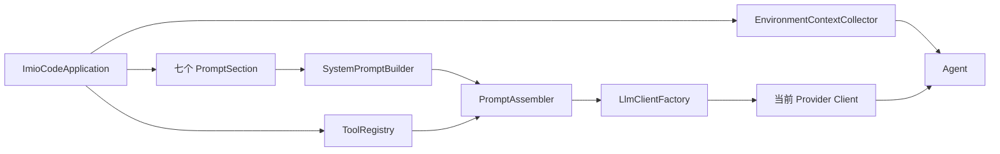
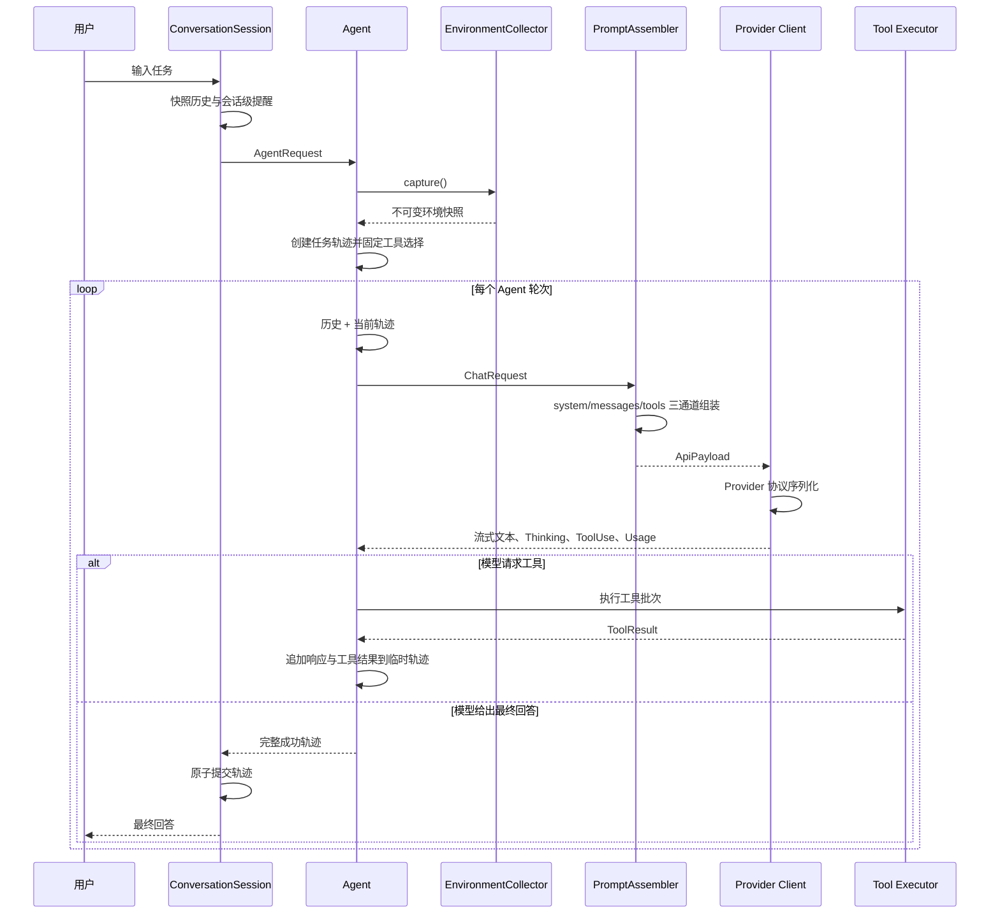

# ImioCode 第五章：Prompt 工程体系 Plan

## 架构概览

采用“统一组装模型”方案，新增独立的 `prompt` 模块作为 Agent 与 Provider 之间的边界。

```text
用户任务
  ↓
EnvironmentContextCollector（每个任务采集一次）
  ↓
Agent（历史、当前轨迹、会话提醒、Plan 轮次提醒）
  ↓
PromptAssembler.assembleApiPayload(...)
  ├─ system：七模块稳定 Prompt
  ├─ messages：环境、提醒、历史、当前轨迹
  ├─ tools：当前模式允许的工具
  └─ cacheIntent：system/tools 的缓存意图
  ↓
Provider Adapter
  ├─ OpenAI：Responses API + 自动前缀缓存
  ├─ Anthropic：system 和 tools 显式 ephemeral 断点
  └─ DeepSeek：自动上下文缓存
  ↓
流式响应 → 统一 TokenUsage
```

主要组件：

1. **System Prompt 组装器**  
   七个固定 Section 各自维护内容和优先级，`SystemPromptBuilder` 负责排序、过滤空模块并生成稳定文本。System Prompt 在应用初始化后保持不变。

2. **环境与提醒组件**  
   `EnvironmentContextCollector` 在每个用户任务开始时生成不可变快照；`SystemReminder` 增加环境级、会话级、轮次级作用域，并统一负责 XML 包装。

3. **统一 Prompt 管线**  
   `PromptAssembler` 接收厂商无关的 `ChatRequest`，集中完成提醒排序、消息注入和工具筛选，输出不可变的 `ApiPayload`。Provider 不再自行决定提醒放入 system 还是 messages。

4. **Provider 序列化适配器**  
   三个客户端只负责把 `ApiPayload` 转换成各自协议。Anthropic 在最后一个工具和 System Prompt 文本块设置 `cache_control: ephemeral`；OpenAI 与 DeepSeek 保持自动缓存，避免向不支持的模型发送非法字段。

5. **Agent 接入**  
   Agent 启动任务时采集一次环境快照，每轮根据模式和轮次生成 Plan Mode 提醒。第 1、6、11……轮使用完整提醒，其余轮使用精简提醒。

6. **Usage 与评估**  
   扩展现有 usage 解析兼容官方缓存字段；自动化测试验证请求结构，真实 DeepSeek 请求验证缓存命中，五个脚本用于人工定性评估。

官方规则依据：OpenAI 对符合条件的请求自动按精确前缀缓存，缓存至少要求 1024 tokens；Anthropic 的缓存前缀顺序为 tools → system → messages，并建议在最后一个工具设置缓存断点；DeepSeek 缓存默认启用且通过 `prompt_cache_hit_tokens` 报告命中。

- [OpenAI Prompt Caching](https://developers.openai.com/api/docs/guides/prompt-caching)
- [Anthropic Prompt Caching](https://platform.claude.com/docs/en/build-with-claude/prompt-caching)
- [Anthropic Tool Caching](https://platform.claude.com/docs/en/agents-and-tools/tool-use/tool-use-with-prompt-caching)
- [DeepSeek Context Caching](https://api-docs.deepseek.com/guides/kv_cache/)

## 核心数据结构

### SectionPriority

```java
public enum SectionPriority {
    IDENTITY(100),
    BEHAVIOR(200),
    TOOL_USAGE(300),
    CODE_QUALITY(400),
    SECURITY(500),
    TASK_PATTERN(600),
    OUTPUT_STYLE(700);

    public int value();
}
```

### Section

```java
public record Section(
        String name,
        SectionPriority priority,
        String content
) {}
```

### PromptSection

```java
public interface PromptSection {
    Section section();
}
```

七个固定实现：

- `IdentitySection`
- `BehaviorSection`
- `ToolUsageSection`
- `CodeQualitySection`
- `SecuritySection`
- `TaskPatternSection`
- `OutputStyleSection`

### SystemPromptBuilder

```java
public final class SystemPromptBuilder {
    public SystemPromptBuilder(List<PromptSection> sections);
    public String build();
}
```

`build()` 按 `priority.value()` 排序，过滤空内容，用固定标题和换行格式连接。构造时复制模块列表，生成结果后由组装器复用。

### ReminderScope

```java
public enum ReminderScope {
    ENVIRONMENT,
    SESSION,
    ROUND
}
```

### SystemReminder

```java
public record SystemReminder(
        ReminderScope scope,
        String content
) {
    public SystemReminder(String content);
    public String wrappedContent();
}
```

单参数构造器用于兼容旧调用，默认作用域为 `SESSION`。`wrappedContent()` 统一生成：

```xml
<system-reminder>
提醒正文
</system-reminder>
```

Provider 不再自行拼接 XML。

### GitWorkingTreeState

```java
public enum GitWorkingTreeState {
    CLEAN,
    DIRTY,
    NOT_REPOSITORY,
    UNAVAILABLE
}
```

### GitContext

```java
public record GitContext(
        Optional<String> branch,
        GitWorkingTreeState state
) {}
```

### EnvironmentContext

```java
public record EnvironmentContext(
        Path workspace,
        String operatingSystem,
        String shell,
        ZonedDateTime capturedAt,
        GitContext git
) {}
```

### EnvironmentContextProvider

```java
@FunctionalInterface
public interface EnvironmentContextProvider {
    EnvironmentContext capture();
}
```

### EnvironmentContextCollector

```java
public final class EnvironmentContextCollector
        implements EnvironmentContextProvider {

    public EnvironmentContextCollector(
            Path workspace,
            Clock clock,
            Duration gitTimeout
    );

    @Override
    public EnvironmentContext capture();
}
```

### EnvironmentReminderFormatter

```java
public final class EnvironmentReminderFormatter {
    public SystemReminder format(EnvironmentContext context);
}
```

实现只保留 Git 分支及 `clean/dirty` 状态，不注入文件名、命令原始输出或环境变量。Shell 通过父进程名称识别并只保留可执行文件名，失败时使用经过固定映射的 OS 默认值。

### CacheDirective

```java
public enum CacheDirective {
    NONE,
    EPHEMERAL
}
```

### CacheIntent

```java
public record CacheIntent(
        CacheDirective system,
        CacheDirective tools
) {
    public static CacheIntent stableChannels();
}
```

### ApiPayload

```java
public record ApiPayload(
        String systemPrompt,
        List<ChatMessage> messages,
        List<ToolDefinition> tools,
        CacheIntent cacheIntent,
        OptionalInt outputTokenLimit
) {}
```

### PromptAssembler

```java
public final class PromptAssembler {
    public PromptAssembler(
            SystemPromptBuilder systemPromptBuilder,
            ToolRegistry toolRegistry
    );

    public ApiPayload assembleApiPayload(ChatRequest request);
}
```

组装顺序固定为：

```text
ENVIRONMENT reminders
→ SESSION reminders
→ ChatRequest.messages（历史 + 当前任务轨迹）
→ ROUND reminders
```

提醒在 `ApiPayload.messages` 中转换为独立的 `role=user` 消息。工具通过当前 `ToolSelection` 筛选并保持名称排序。

### ToolRegistry 补充接口

```java
public List<ToolDefinition> enabledDefinitions(
        ToolSelection selection
);
```

原有 `exportEnabled(...)` 保留，避免破坏现有调用方；Provider 后续统一消费 `ApiPayload.tools()`。

### PlanModePrompt 补充接口

```java
public final class PlanModePrompt {
    public static ToolSelection toolSelection(AgentMode mode);

    public static Optional<SystemReminder> reminder(
            AgentMode mode,
            int iteration
    );
}
```

`iteration` 为 1、6、11……时返回完整 `ROUND` 提醒，其余 Plan Mode 轮次返回精简提醒；正常模式返回空。

### TokenUsage

继续使用现有模型：

```java
public record TokenUsage(
        OptionalLong inputTokens,
        OptionalLong outputTokens,
        OptionalLong reasoningTokens,
        OptionalLong cacheReadTokens,
        OptionalLong cacheWriteTokens
) {}
```

不新增重复模型，只扩展 Provider 解析：

- OpenAI：读取 `cached_tokens`，同时兼容 `cache_write_tokens`。
- Anthropic：读取 `cache_read_input_tokens` 和 `cache_creation_input_tokens`。
- DeepSeek：优先读取官方的 `prompt_cache_hit_tokens`，兼容原有 `prompt_tokens_details.cached_tokens`。

## 模块设计

### 七模块 System Prompt

七个模块使用固定、精简的中文指令，避免相同规则重复出现。

#### IdentitySection

- 定义 ImioCode 是运行在用户工作区中的终端 AI 编程助手。
- 目标是理解任务、使用工具取得证据并完成用户授权范围内的工作。

#### BehaviorSection

- 回答、审查、诊断类任务只调查和报告。
- 修改、构建、修复类任务应完成范围内改动和验证。
- 只有缺少会显著改变结果的关键信息时才询问用户。
- 不得把推测表述成已经验证的事实。

#### ToolUsageSection

- 项目探索优先使用 Glob、Grep、ReadFile。
- 修改前先读取，局部修改优先 EditFile。
- WriteFile 主要用于新建文件或明确要求的完整覆盖。
- Bash 用于专用工具无法完成的命令、构建和测试。
- 工具失败后必须根据实际错误调整方案，不能盲目重试。

#### CodeQualitySection

- 保持改动聚焦，遵循现有代码结构、风格和编码。
- 不修改无关代码，不覆盖用户已有改动。
- 修改后运行与风险匹配的编译或测试。
- 注释解释原因，不重复代码表面行为。

#### SecuritySection

- 操作必须限制在工作区内。
- 不输出凭据、密钥或敏感内容。
- 不执行无关、不可逆或破坏性操作。
- 不因完成局部任务而扩大到外部系统写入。

#### TaskPatternSection

- 默认遵循“探索 → 判断 → 修改 → 验证 → 汇报”。
- 已获得足够上下文时直接行动，避免重复读取。
- 验证失败时继续分析和修复，直到完成或出现明确阻塞。

#### OutputStyleSection

- 默认使用中文，先给结果，再给必要证据。
- 简洁说明修改内容、验证结果和剩余问题。
- 不输出虚假的测试通过、缓存命中或工具执行结论。

`SystemPromptBuilder` 只负责确定性排序和渲染，不读取环境、模式、历史或时间。

### 环境上下文模块

`EnvironmentContextCollector` 的职责：

- 工作目录来自应用启动时解析出的规范化 `workspace`。
- OS 来自 Java 系统属性，只保留系统名称与架构。
- Shell 优先读取父进程命令的文件名，不保留完整路径；无法识别时按 OS 使用固定名称。
- 时间使用注入的 `Clock` 生成带时区的 ISO 格式。
- Git 使用 `ProcessBuilder` 直接执行参数化命令，不经过 Shell。
- Git 命令设置短超时，只解析分支及 clean/dirty，不注入文件路径或原始输出。
- Git 不存在、超时或当前目录不是仓库时返回对应状态，不中断 Agent 任务。

`EnvironmentReminderFormatter` 只负责把快照转换为 `ENVIRONMENT` 提醒，Agent 在任务开始时调用一次并在所有轮次复用。

### System Reminder 模块

`SystemReminder` 负责：

- 校验内容非空。
- 拒绝正文中嵌套保留的 `<system-reminder>` 标签，避免破坏消息边界。
- 根据 `ReminderScope` 提供稳定排序。
- 统一生成完整 XML 包装文本。

作用域规则：

- `ENVIRONMENT`：由 Agent 自动生成，每个任务最多一条。
- `SESSION`：来自 `ConversationSession` 的一次性提醒，保持加入顺序。
- `ROUND`：由 Plan Mode 生成，每轮最多一条，不进入持久历史。

### PromptAssembler

`PromptAssembler` 构造时完成一次 System Prompt 构建，之后复用同一字符串。

`assembleApiPayload` 的处理顺序：

1. 按作用域稳定划分提醒。
2. 将环境提醒转换为第一条逻辑用户消息。
3. 追加会话级提醒。
4. 追加历史和当前 Agent 轨迹。
5. 追加当前轮提醒。
6. 根据 `ToolSelection` 获取名称排序后的工具定义。
7. 为 system 和非空 tools 设置 `EPHEMERAL` 缓存意图。
8. 返回完全不可变的 `ApiPayload`。

组装器不读取 Provider 配置，也不生成任何厂商 JSON。

### Agent 与 Plan Mode

Agent 在 `run()` 开始时：

1. 固定当前 Agent Mode。
2. 采集环境快照并生成环境提醒。
3. 固定当前任务的工具选择。
4. 保存会话级提醒，不写入轨迹。

每轮开始时调用 `PlanModePrompt.reminder(mode, iteration)`：

- `(iteration - 1) % 5 == 0`：完整 Plan Mode 指令。
- 其他 Plan Mode 轮次：精简的“保持只读、继续调查、最终输出计划”提醒。
- 正常模式：无轮次提醒。

Agent 的停止条件、重试、工具调度和历史提交逻辑不变。

### Provider 适配

#### OpenAI

- `systemPrompt` 写入 Responses API 的 `instructions`。
- `messages` 写入 `input`。
- `tools` 使用现有 function 定义格式。
- 不发送 `cache_control` 或仅新模型支持的显式断点字段，保持跨模型兼容并使用自动缓存。
- 解析 `input_tokens_details.cached_tokens` 和 `cache_write_tokens`。

#### Anthropic

- `systemPrompt` 写成单个 system text block，并附加 `cache_control: {"type":"ephemeral"}`。
- 在最后一个工具定义上附加相同缓存标记，使整个工具前缀可缓存。
- 提醒已经在 `messages` 中，不再写入 system。
- 协议需要时合并相邻同角色消息，但保持各提醒为独立 text block、顺序不变。
- 继续解析缓存读取量与创建量。

#### DeepSeek

- 在 messages 首部增加唯一的 `role=system` System Prompt。
- 后续直接序列化组装后的 messages。
- 不发送额外缓存字段，使用默认上下文缓存。
- 解析官方顶层 `prompt_cache_hit_tokens`；同时保留旧格式兼容。

### 工具描述

只强化 `ToolDefinition.description` 和必要的参数说明，不改变名称、Schema 或执行行为：

- ReadFile：查看文本内容和局部行范围，修改前优先读取。
- Glob：按文件名和路径发现候选文件，通常作为项目探索第一步。
- Grep：搜索符号或内容，定位后配合 ReadFile 阅读上下文。
- EditFile：仅替换唯一匹配文本，要求先读取并提供精确旧文本。
- WriteFile：创建文件或完整覆盖；已有文件的小改动优先 EditFile。
- Bash：运行构建、测试及专用工具无法完成的命令，不用于替代 Glob、Grep、ReadFile、EditFile。

### Usage 与评估

- 继续通过现有 `TokenUsageBuilder` 聚合数据。
- 现有终端 `UsageFormatter` 已支持展示 `cache-read` 和 `cache-write`，无需新增 UI 协议。
- Provider 模拟测试验证请求 JSON 和 usage 解析。
- `docs/ch5/eval-scenarios.md` 保存五个场景的输入、准备条件、预期工具顺序、观察点和记录表。
- 真实缓存验收使用当前 DeepSeek 配置连续发送两次相同稳定前缀请求，并记录实际 usage。

## 模块交互

### 应用启动



启动阶段完成：

1. 注册六个核心工具。
2. 创建七个固定 Prompt Section。
3. 构建并保存稳定 System Prompt。
4. 创建统一 `PromptAssembler`。
5. 将相同组装器交给当前 Provider。
6. 将绑定工作区的环境采集器交给 Agent。

### 普通任务



环境提醒和会话提醒不加入 `trajectory`，因此正常提交历史时不会被持久化。

### Plan Mode 任务

```text
任务开始：
  固定 mode=PLAN
  固定 tools=ReadFile/Glob/Grep
  采集一次环境

第 1 轮：
  environment → session reminders → history/trajectory → full plan reminder

第 2～5 轮：
  environment → session reminders → history/trajectory → concise plan reminder

第 6 轮：
  environment → session reminders → history/trajectory → full plan reminder
```

工具结果只追加到轨迹；下一轮重新生成轮次提醒。切换 `/do` 只影响下一个任务，不修改已经运行中的任务快照。

### Provider 映射

| 统一通道 | OpenAI | Anthropic | DeepSeek |
|---|---|---|---|
| system | `instructions` | system text block | 首条 system message |
| messages | `input` items | `messages` content blocks | chat messages |
| tools | function tools | Anthropic tools | function tools |
| system 缓存 | 自动缓存 | explicit ephemeral | 自动缓存 |
| tools 缓存 | 自动缓存 | 最后一个工具设置 ephemeral | 自动缓存 |

Anthropic 对连续同角色消息的协议归并发生在最后一步，只合并外层消息；每个提醒仍保留为独立 text block。

### 缓存边界

```text
稳定前缀：
  工具定义 + 七模块 System Prompt

动态后缀：
  环境提醒 + 会话提醒 + 历史 + 当前轨迹 + 轮次提醒
```

- 同一模式下，工具定义和 System Prompt 顺序固定。
- Plan Mode 与正常模式的工具集合不同，因此各自形成独立缓存前缀。
- 环境时间、Git 状态及 Plan 轮次提醒变化不会修改 System Prompt。
- LLM 重试复用同一个环境快照和相同轮次提醒，避免同一轮请求发生无意义变化。
- usage 由 Provider 解析后沿现有事件流传递，不让 Prompt 模块依赖终端 UI。

## 文件组织

```text
src/main/java/io/imiocode/
├── prompt/
│   ├── Section.java
│   ├── SectionPriority.java
│   ├── PromptSection.java
│   ├── SystemPromptBuilder.java
│   ├── ApiPayload.java
│   ├── CacheDirective.java
│   ├── CacheIntent.java
│   ├── PromptAssembler.java
│   ├── EnvironmentContext.java
│   ├── EnvironmentContextProvider.java
│   ├── EnvironmentContextCollector.java
│   ├── EnvironmentReminderFormatter.java
│   ├── GitContext.java
│   ├── GitWorkingTreeState.java
│   └── section/
│       ├── IdentitySection.java
│       ├── BehaviorSection.java
│       ├── ToolUsageSection.java
│       ├── CodeQualitySection.java
│       ├── SecuritySection.java
│       ├── TaskPatternSection.java
│       └── OutputStyleSection.java
├── conversation/
│   ├── ReminderScope.java
│   └── SystemReminder.java
├── agent/
│   ├── Agent.java
│   └── PlanModePrompt.java
├── llm/
│   ├── LlmClientFactory.java
│   └── provider/
│       ├── openai/OpenAiClient.java
│       ├── anthropic/AnthropicClient.java
│       └── deepseek/DeepSeekClient.java
├── tool/
│   ├── ToolRegistry.java
│   └── core/
│       ├── ReadFileTool.java
│       ├── WriteFileTool.java
│       ├── EditFileTool.java
│       ├── BashTool.java
│       ├── GlobTool.java
│       └── GrepTool.java
└── ImioCodeApplication.java

src/test/java/io/imiocode/
├── prompt/
│   ├── SystemPromptBuilderTest.java
│   ├── PromptAssemblerTest.java
│   ├── EnvironmentContextCollectorTest.java
│   └── EnvironmentReminderFormatterTest.java
├── conversation/
│   └── SystemReminderTest.java
├── agent/
│   ├── PlanModePromptTest.java
│   └── AgentTest.java
├── llm/provider/
│   ├── openai/OpenAiClientTest.java
│   ├── anthropic/AnthropicClientTest.java
│   └── deepseek/DeepSeekClientTest.java
└── tool/core/
    └── CoreToolDescriptionTest.java

docs/ch5/
├── spec.md
├── plan.md
├── task.md
├── checklist.md
└── eval-scenarios.md
```

说明：

- 七个 Section 独立成文件，方便逐模块调整 Prompt，并能单独测试优先级和内容。
- 环境采集相关类型集中在 `prompt` 包，不让 Agent 直接处理 Git、时间和 Shell 细节。
- Provider 不新增平行的组装逻辑，只修改现有客户端的协议序列化入口。
- `ChatRequest` 保持现有字段结构，作用域信息由升级后的 `SystemReminder` 携带。
- 现有 Provider、Agent 和工具测试继续保留，仅在原文件增加回归场景。
- 真实 API 缓存测试不会放进默认 Maven 单元测试，避免常规测试消耗 Token；它记录在 checklist 和评估文档中手动执行。

## 技术决策

| 决策点 | 选择 | 理由 |
|---|---|---|
| Prompt 模块表达 | `Section` 不可变数据 + 七个 `PromptSection` 实现 | 同时保留统一排序能力和清晰模块边界 |
| Prompt 内容语言 | 固定中文指令，工具名和协议名保留英文 | 与 ImioCode 当前用户界面一致，减少中英文重复说明 |
| Prompt 内容存放 | 编译进七个 Java Section 类 | 内容可审查、可测试、版本受 Git 管理；本章不引入远程模板或配置系统 |
| Section 排序 | 显式数值优先级，名称作为相同优先级的稳定次排序 | 注册顺序变化时输出仍完全确定 |
| System Prompt 生命周期 | 应用启动时构建一次，后续请求复用 | 防止时间、环境和模式污染稳定缓存前缀 |
| 三通道边界 | `ApiPayload` 作为 Provider 无关的不可变边界 | 集中验证路由规则，Provider 只处理协议差异 |
| 提醒位置 | 统一转换为逻辑 `role=user` 消息 | Plan Mode 和环境变化不会修改 System Prompt |
| 提醒包装 | `SystemReminder` 统一生成 XML | 避免三个 Provider 各自拼接产生格式差异 |
| 环境刷新 | 每个 Agent 任务采集一次 | 同一 Agent Loop 内请求稳定，下一个任务又能得到最新环境 |
| Git 信息 | 只保留分支和 clean/dirty 状态 | 满足任务上下文需求，同时避免把文件路径或原始命令输出注入模型 |
| 环境采集失败 | 降级为 unavailable，不终止任务 | Git 或父进程信息不是完成编码任务的硬依赖 |
| 工具顺序 | 沿用注册中心按名称排序 | 当前行为已经确定，避免新增缓存抖动 |
| OpenAI 缓存 | 使用自动缓存，不发送显式断点字段 | 项目允许配置不同 OpenAI 模型；官方说明旧模型会拒绝新显式字段，而自动缓存无需改请求即可工作 |
| Anthropic 缓存 | System Prompt text block 和最后一个工具各放一个 ephemeral 断点 | 官方缓存顺序是 tools → system → messages；两个断点分别稳定覆盖工具和 System Prompt |
| DeepSeek 缓存 | 不发送控制字段，使用默认缓存 | DeepSeek 官方缓存默认开启，不需要修改请求 |
| CacheIntent | 统一表达“希望缓存 system/tools”，由 Provider 决定是否能显式实现 | 业务层不依赖某家 API 字段 |
| Usage 兼容 | 官方字段优先，旧字段作为回退 | 修正当前 DeepSeek 字段差异，同时不破坏既有兼容测试 |
| Plan 提醒周期 | 第 1 轮及之后每隔 5 轮使用完整提醒 | 符合已确认的 1、6、11……节奏，其余轮减少 Token 重复 |
| Plan 工具限制 | 继续使用现有 `ToolSelection` | 不改注册中心全局状态，也不影响并发和普通模式 |
| 定性评估 | Markdown 场景脚本 + 人工记录表 | 本章明确不做 LLM-as-judge，人工对照更符合范围 |
| 真实缓存验收 | 使用当前 DeepSeek 配置，顺序发送两次相同稳定前缀请求 | 第一请求完成后再发第二请求，避免并发造成缓存尚未建立；只接受真实 usage |
| 默认测试策略 | Mock Server 验证三家请求，真实 API 测试手动执行 | 单元测试保持确定、免费且不依赖 API Key |
| Agent Loop | 只改变请求输入组装，不修改循环、重试、调度和终态 | 控制本章范围并降低 Ch4 回归风险 |

## 兼容补充设计

### 架构概览

采用兼容扩展设计，保持现有 system、messages、tools 三通道边界不变：

1. `SystemPromptBuilder` 增加空构造和链式注册能力，保留列表构造和默认七模块入口。
2. `BuildOptions` 保存自定义指令、Skill、Memory 三段可选稳定文本，由默认构建入口追加到七个核心模块之后。
3. `EnvironmentContext` 增加架构和模型，并根据 Git 状态提供是否为仓库；新增字段继续通过环境提醒进入 messages。
4. Agent 使用单个原子模式状态保存当前模式和退出提醒待消费标记，在下一个普通任务启动时原子消费。

```text
稳定：七个核心模块 + 非空可选模块 → System Prompt
动态：扩展环境 + 会话提醒 + 轨迹 + Plan/退出提醒 → messages
工具：当前模式允许的定义 → tools
```

### 核心数据结构

`SectionPriority` 在原有 100～700 优先级之后增加：

```java
CUSTOM_INSTRUCTIONS(800),
SKILL(900),
MEMORY(950)
```

`SystemPromptBuilder` 补充：

```java
public SystemPromptBuilder();
public SystemPromptBuilder add(PromptSection section);
public static SystemPromptBuilder defaults(BuildOptions options);
```

现有列表构造器、`defaults()` 和 `build()` 保留。

`BuildOptions`：

```java
public record BuildOptions(
        Optional<String> customInstructions,
        Optional<String> skillContent,
        Optional<String> memoryContent
) {
    public BuildOptions(
            String customInstructions,
            String skillContent,
            String memoryContent
    );

    public static BuildOptions empty();
}
```

三个固定可选模块：

```java
public final class CustomInstructionsSection implements PromptSection;
public final class SkillSection implements PromptSection;
public final class MemorySection implements PromptSection;
```

`EnvironmentContext` 扩展：

```java
public record EnvironmentContext(
        Path workspace,
        String operatingSystem,
        String architecture,
        String shell,
        ZonedDateTime capturedAt,
        GitContext git,
        String model
) {
    public EnvironmentContext(
            Path workspace,
            String operatingSystem,
            String shell,
            ZonedDateTime capturedAt,
            GitContext git
    );

    public Optional<Boolean> isGitRepository();
}
```

旧五参数构造器将 architecture 和 model 固定为 `unknown`。

`EnvironmentContextCollector` 增加接收模型名的构造器，同时保留旧构造器：

```java
public EnvironmentContextCollector(
        Path workspace,
        Clock clock,
        Duration gitTimeout,
        String model
);
```

`PlanModePrompt` 增加：

```java
public static SystemReminder exitReminder();
```

Agent 内部增加：

```java
private record ModeState(
        AgentMode mode,
        boolean exitReminderPending
) {}

private record TaskModeSnapshot(
        AgentMode mode,
        boolean includeExitReminder
) {}
```

### 模块设计

#### Builder 与可选模块

- 空构造器创建可增量注册的 Builder。
- `add` 立即拒绝空模块并返回当前 Builder。
- `build` 对当前模块建立快照，检查重名、过滤空内容，并按优先级和名称稳定排序。
- `BuildOptions` 将 null、空字符串和纯空白内容归一为空 Optional。
- `defaults(BuildOptions)` 先注册七个核心模块，再按 CustomInstructions、Skill、Memory 注册非空模块。
- `PromptAssembler` 仍在构造时只调用一次 `build()`，Provider 请求期间不改变 System Prompt。

#### 环境上下文

- OS 与架构分别读取 `os.name` 和 `os.arch`。
- 当前模型由 `ImioCodeApplication` 从已解析的应用配置传给采集器。
- Git clean/dirty 表示仓库为是，NOT_REPOSITORY 表示否，UNAVAILABLE 表示未知。
- 环境提醒字段顺序固定为：工作目录、OS、架构、Shell、时间、时区、Git 仓库、Git 分支、Git 状态、模型。

#### 退出 Plan Mode

模式状态变化规则：

```text
初始：DO, pending=false
PLAN → DO：DO, pending=true
下一普通任务启动：原子消费 pending
DO → DO：不创建 pending
PLAN → DO → PLAN：清除 pending
```

任务开始时原子取得 `TaskModeSnapshot`。`includeExitReminder=true` 时，仅在 iteration=1 追加 `ROUND` 作用域的退出提醒。退出提醒不加入 trajectory 或正式历史。

### 文件组织

```text
src/main/java/io/imiocode/
├── ImioCodeApplication.java
├── agent/
│   ├── Agent.java
│   └── PlanModePrompt.java
└── prompt/
    ├── BuildOptions.java
    ├── SectionPriority.java
    ├── SystemPromptBuilder.java
    ├── EnvironmentContext.java
    ├── EnvironmentContextCollector.java
    ├── EnvironmentReminderFormatter.java
    └── section/
        ├── CustomInstructionsSection.java
        ├── SkillSection.java
        └── MemorySection.java
```

测试修改：

```text
src/test/java/io/imiocode/
├── prompt/
│   ├── SystemPromptBuilderTest.java
│   ├── EnvironmentContextCollectorTest.java
│   └── EnvironmentReminderFormatterTest.java
└── agent/
    ├── AgentTest.java
    └── PlanModePromptTest.java
```

### 技术决策

| 决策点 | 选择 | 理由 |
|---|---|---|
| Builder 扩展 | 保留列表构造，增加空构造与 `add` | 向后兼容并支持链式注册 |
| 可选内容顺序 | 位于七个核心模块之后 | 不改变已验证的核心顺序 |
| 空内容处理 | 在 `BuildOptions` 中归一为空 Optional | 不产生空标题或无意义缓存变化 |
| 环境模型来源 | 应用配置显式传入 | 与真实 Provider 配置一致，不重复读取环境变量 |
| Git 仓库状态 | `Optional<Boolean>` | 区分非仓库和无法判断 |
| 模式状态 | 单个原子不可变状态 | 避免模式与 pending 两个原子变量产生竞态 |
| 退出提醒 | 下一普通任务第一轮一次 | 明确模式变化且不污染历史 |
