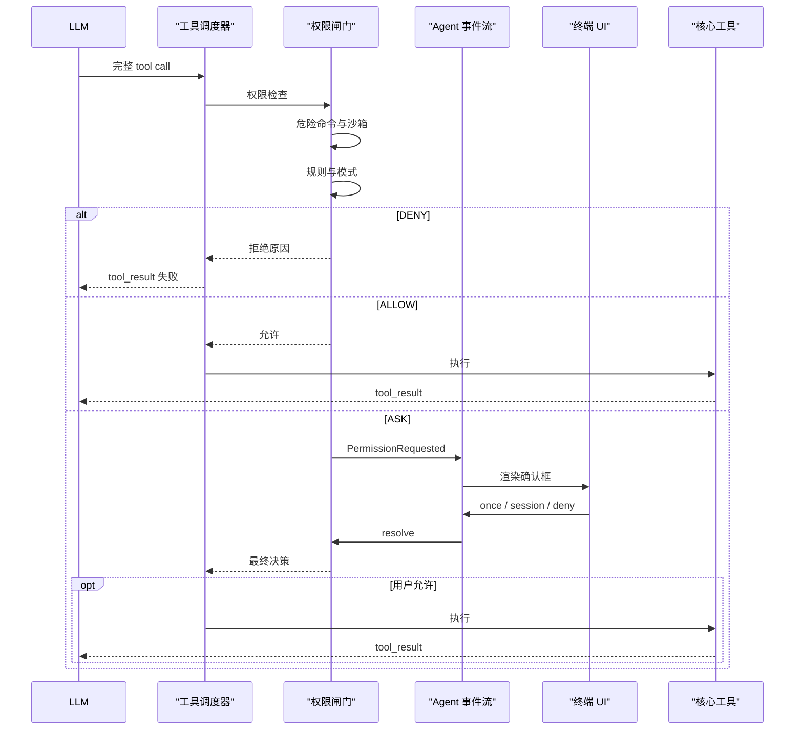

# ch6 权限系统 Plan

## 架构概览

技术设计采用集中式权限闸门，新增 `io.imiocode.permission` 包，权限逻辑不散落到六个工具内部。

### 1. 权限领域层

定义统一的权限请求、目标、决策和模式模型。所有工具调用先转换成标准权限请求，再输出 `ALLOW`、`ASK` 或 `DENY`，避免不同工具各自解释规则。

### 2. 硬安全层

由两个不可绕过的组件组成：

- `DangerousCommandDetector`：规范化并检查 PowerShell/Bash 命令，命中后直接拒绝。
- `PathSandbox`：复用并强化现有 `WorkspacePolicy`，统一验证文件工具的工作区相对路径、真实路径和链接逃逸。

硬安全层优先于规则、模式和用户确认。

### 3. 规则与模式层

- `PermissionRuleLoader` 在会话启动时加载三层 YAML。
- `PermissionRuleEngine` 按“层级优先、文件内第一条匹配”执行 glob 匹配。
- `PermissionModePolicy` 定义五种模式的默认行为和不可突破的模式上限。
- `PermissionChecker` 串联硬安全、规则和模式，生成带原因及来源的初步决策。

### 4. 会话授权与 HITL 层

`PermissionCoordinator` 负责：

- 保存“本次会话允许同类操作”的临时授权；
- 为 `ASK` 创建唯一请求；
- 发布 Agent 权限事件；
- 等待 UI 回复；
- 在取消、超时或关闭时拒绝所有等待请求。

权限核心只认识确认结果，不依赖 JLine 或具体终端。

### 5. 工具调度接入

权限闸门接入 `StreamingToolScheduler`，位于工具真正启动之前：

- `ALLOW`：可继续按原有安全并发策略执行。
- `DENY`：直接生成失败的工具结果，不启动工具。
- `ASK`：先设置调度屏障，等模型流结束后按原始调用顺序逐个确认。
- 流式阶段只有已经明确 `ALLOW` 的低风险工具可以提前执行；需要确认的工具绝不会提前进入线程池。
- 获得允许后再标记“可能产生副作用”。

现有 `ToolExecutor` 继续只负责执行已经授权的工具。

### 6. Agent 与终端接入

- `AgentEvent` 增加权限请求和权限结果事件。
- `Agent` 持有权限协调器，并公开按请求 ID 回复确认的入口。
- `ConversationSession` 转发确认回复和取消操作。
- `ConversationLoop` 收到权限请求后调用终端确认方法，并将选择回复给会话。
- `TerminalUi` 新增确认能力；`JLineTerminalUi` 渲染三选一对话框。
- 确认期间使用新的 UI 状态，普通对话输入不会与确认输入竞争。

## 核心数据结构

### 权限枚举

```java
public enum PermissionMode {
    LOCKDOWN,
    READ_ONLY,
    ASK,
    AUTO_EDIT,
    FULL_ACCESS
}

public enum PermissionAction {
    ALLOW,
    ASK,
    DENY
}

public enum PermissionOperation {
    READ,
    WRITE,
    COMMAND
}

public enum PermissionRuleLayer {
    USER,
    PROJECT,
    LOCAL
}

public enum PermissionReply {
    ALLOW_ONCE,
    ALLOW_SESSION,
    DENY
}
```

### `PermissionRequest`

```java
public record PermissionRequest(
        ToolCall call,
        ToolRisk risk,
        PermissionOperation operation,
        String normalizedTarget,
        String displayTarget
) {}
```

- `normalizedTarget`：用于规则匹配和会话授权键，不直接展示。
- `displayTarget`：经过截断与脱敏，仅供终端确认使用。
- 工具映射：
  - `read_file`、`glob`、`grep` → `READ`
  - `write_file`、`edit_file` → `WRITE`
  - `bash` → `COMMAND`

### `PermissionDecision`

```java
public record PermissionDecision(
        PermissionAction action,
        PermissionDecisionSource source,
        String reason
) {}
```

`PermissionDecisionSource` 用于区分危险命令、沙箱、三层规则、权限模式、会话授权和用户回复，方便 UI 给出准确原因。

### `PermissionRule`

```java
public record PermissionRule(
        PermissionRuleLayer layer,
        PermissionAction action,
        String toolPattern,
        Optional<String> targetPattern
) {}
```

规则配置格式：

```yaml
mode: ask
rules:
  - action: allow
    tool: "read_*"
    target: "src/**"

  - action: ask
    tool: "bash"
    target: "mvn test*"

  - action: deny
    tool: "write_file"
    target: ".github/**"
```

每层文件的 `mode` 可选。最终模式取第一个明确配置的值，顺序仍为用户级、项目级、本地级；都未配置则使用 `ASK`。

### `PermissionSettings`

```java
public record PermissionSettings(
        PermissionMode mode,
        List<PermissionRule> userRules,
        List<PermissionRule> projectRules,
        List<PermissionRule> localRules
) {}
```

所有集合在构造时复制为不可变集合，会话期间不重新读取磁盘。

## 核心接口

### 权限请求提取

```java
public final class PermissionRequestFactory {
    public PermissionRequest create(
            ToolCall call,
            ToolDefinition definition
    );
}
```

负责读取六种工具的真实参数：

- 文件工具：`path`
- Glob：`pattern`
- Grep：`path`，缺省为 `.`
- Bash：`command`

缺少必要参数或目标无法规范化时，产生拒绝决策，不以异常方式绕过检查。

### 危险命令检测

```java
public interface DangerousCommandDetector {
    Optional<DangerousCommandMatch> inspect(
            String command,
            Path workspace
    );
}
```

`DangerousCommandMatch` 只包含安全的规则编号和原因，不回显完整危险命令。

### 路径沙箱

```java
public interface PathSandbox {
    SandboxResult inspect(PermissionRequest request);

    Path revalidateWritable(Path target);
}
```

- `inspect` 用于工具调度前预检。
- `revalidateWritable` 在真正写入前复检。
- 现有 `WorkspacePolicy` 作为底层路径解析器继续被六个工具复用，避免权限检查和工具执行采用两套路径语义。

### 规则加载与匹配

```java
public final class PermissionRuleLoader {
    public PermissionSettings load(
            Path workspace,
            Path userHome
    );
}

public final class PermissionRuleEngine {
    public Optional<PermissionDecision> evaluate(
            PermissionRequest request,
            PermissionSettings settings
    );
}
```

Glob 匹配统一使用 `/` 分隔符，并自行转换为确定性的正则表达式，避免 Java 平台 `PathMatcher` 在 Windows 与 Unix 上行为不同。

### 模式与总检查器

```java
public final class PermissionModePolicy {
    public PermissionDecision evaluate(
            PermissionRequest request,
            PermissionMode mode
    );
}

public final class PermissionChecker {
    public PermissionDecision check(PermissionRequest request);
}
```

`PermissionChecker` 内部顺序固定：

1. 危险命令检测；
2. 路径沙箱；
3. `LOCKDOWN`、`READ_ONLY` 模式上限；
4. 三层显式规则；
5. 当前模式默认行为。

### HITL 模型

```java
public record PermissionPrompt(
        String requestId,
        int iteration,
        String toolName,
        ToolRisk risk,
        String targetSummary,
        String reason
) {}

public final class PermissionCoordinator {
    public PermissionDecision confirm(
            PermissionRequest request,
            PermissionDecision askDecision,
            int iteration,
            Consumer<PermissionPrompt> publisher
    );

    public boolean resolve(String requestId, PermissionReply reply);

    public void cancelAll();
}
```

- `confirm` 先检查会话授权缓存；未命中时发布请求并等待。
- `ALLOW_SESSION` 使用“规范化工具名 + 规范化目标”作为会话键。
- `resolve` 可由终端、测试替身或未来其他 UI 调用。
- `cancelAll` 将全部等待请求完成为拒绝。

### Agent 事件

新增两个纯数据事件：

```java
record PermissionRequested(PermissionPrompt prompt)
        implements AgentEvent {}

record PermissionResolved(
        String requestId,
        PermissionReply reply
) implements AgentEvent {}
```

终端收到 `PermissionRequested` 后显示确认框，再通过会话入口提交 `PermissionReply`。事件本身不携带终端对象或 UI 回调。

## 模块设计

### `io.imiocode.permission.command`

包含危险命令规范化和黑名单检测：

- 将命令统一为小写匹配视图，但保留原始文本用于执行。
- 识别 PowerShell/Bash 的命令分隔符、管道和条件连接。
- 黑名单按类别拆分：磁盘破坏、系统删除、系统控制、进程灾难、Git/工作区整体清理。
- 每条模式使用预编译正则，并配套正例、反例测试。
- 检测结果只返回稳定规则 ID 和安全原因。

### `io.imiocode.permission.sandbox`

包含 `WorkspacePathSandbox`，与现有 `WorkspacePolicy` 协作：

- 权限预检先拒绝绝对路径、`..` 和链接逃逸。
- 文件工具仍在执行时调用 `WorkspacePolicy` 获取实际目标。
- WriteFile/EditFile 在产生副作用前再次验证目标。
- Glob/Grep 的 pattern 或 path 同样经过工作区范围检查。
- 路径无法确认安全时按 `DENY` 处理。

### `io.imiocode.permission.rule`

包含：

- 三层 YAML 文档模型；
- `PermissionRuleLoader`；
- 跨平台 Glob 编译器；
- `PermissionRuleEngine`。

加载流程：

1. 按固定路径检查三个文件；
2. 文件不存在则跳过；
3. 存在但不是普通文件、包含未知字段、非法模式、非法 action 或非法 glob 时启动失败；
4. 分层保留规则顺序；
5. 按用户级、项目级、本地级解析最终模式；
6. 生成不可变 `PermissionSettings`。

### `io.imiocode.permission`

领域对象和统一检查入口：

- `PermissionRequestFactory` 负责工具调用到权限请求的映射。
- `PermissionModePolicy` 负责五种模式。
- `PermissionChecker` 串联五层防线。
- `PermissionCoordinator` 管理请求 ID、等待结果和会话临时授权。
- `PermissionGate` 对调度器提供一个入口，将初步检查与 HITL 组合起来。

```java
public final class PermissionGate {
    public PermissionDecision authorize(
            ToolCall call,
            ToolDefinition definition,
            int iteration,
            Consumer<PermissionPrompt> publisher
    );

    public boolean resolve(String requestId, PermissionReply reply);

    public void cancelPending();

    public void close();
}
```

### Agent 调度模块改造

`StreamingToolScheduler` 在每个完整工具调用到达时执行权限预检：

- 未知、禁用或 Plan Mode 不允许的工具继续走原有失败路径。
- `DENY` 立即记录失败结果。
- `ALLOW + LOW risk` 可以继续流式提前执行。
- `ALLOW + 非 LOW risk` 等模型流完成后串行执行。
- `ASK` 设置调度屏障，等模型流完成后进入 HITL。
- HITL 允许后才启动工具；拒绝则产生权限拒绝结果。
- 一个 `ASK` 前面的已授权低风险工具可以完成；它后面的工具等待该确认处理完毕。
- 所有结果继续按模型原始调用顺序回传。

权限拒绝属于可恢复的工具失败，不直接终止 Agent；模型可以根据结果选择其他方案。

### Agent 生命周期改造

- `Agent` 构造时接收会话级 `PermissionGate`。
- 权限请求由调度器转换成 `AgentEvent.PermissionRequested`。
- `Agent.respondPermission(requestId, reply)` 转交给权限闸门。
- `Agent.cancelActive()`、任务超时和 `Agent.close()` 都会取消待处理确认。
- 会话临时授权跨多轮任务保留，到会话关闭时清空。
- Plan Mode 的工具选择仍是第一道可用性过滤，权限系统在其后继续检查沙箱和规则。

### Conversation 与终端改造

`ConversationSession` 新增：

```java
public boolean respondPermission(
        String requestId,
        PermissionReply reply
);
```

`TerminalUi` 新增：

```java
PermissionReply confirmPermission(PermissionPrompt prompt);
```

`ConversationLoop` 收到权限请求事件后：

1. 结束未关闭的 thinking/assistant 输出行；
2. 切换为 `PERMISSION_WAITING`；
3. 调用终端确认；
4. 把结果提交给当前会话；
5. 展示权限结果；
6. 回到工具等待或执行状态。

JLine 确认框接受：

- `1` / `once`：允许一次；
- `2` / `session`：本次会话允许；
- `3` / `deny`：拒绝。

非法输入继续提示；Ctrl+C、EOF 或终端关闭按拒绝并触发原有取消流程。

### 应用装配

应用启动顺序调整为：

1. 建立工作区策略；
2. 加载三层权限设置；
3. 创建危险检测器、沙箱、规则引擎和权限闸门；
4. 注册六个核心工具；
5. 创建 LLM 客户端、Agent、会话和终端；
6. 会话结束时按反向顺序关闭，确保待确认请求先被唤醒。

## 模块交互



## 文件组织

```text
src/main/java/io/imiocode/
├── permission/
│   ├── PermissionMode.java
│   ├── PermissionAction.java
│   ├── PermissionOperation.java
│   ├── PermissionRuleLayer.java
│   ├── PermissionDecisionSource.java
│   ├── PermissionReply.java
│   ├── PermissionRequest.java
│   ├── PermissionDecision.java
│   ├── PermissionPrompt.java
│   ├── PermissionRule.java
│   ├── PermissionSettings.java
│   ├── PermissionRequestFactory.java
│   ├── PermissionModePolicy.java
│   ├── PermissionChecker.java
│   ├── PermissionCoordinator.java
│   ├── PermissionGate.java
│   ├── command/
│   │   ├── DangerousCommandDetector.java
│   │   ├── DangerousCommandMatch.java
│   │   └── RegexDangerousCommandDetector.java
│   ├── rule/
│   │   ├── PermissionConfigDocument.java
│   │   ├── PermissionRuleLoader.java
│   │   ├── PermissionRuleEngine.java
│   │   └── PermissionGlobMatcher.java
│   └── sandbox/
│       ├── PathSandbox.java
│       ├── SandboxResult.java
│       └── WorkspacePathSandbox.java
├── agent/
│   ├── Agent.java
│   ├── AgentEvent.java
│   ├── StreamingTurnExecutor.java
│   └── StreamingToolScheduler.java
├── conversation/
│   ├── ConversationSession.java
│   └── ConversationLoop.java
├── terminal/
│   ├── TerminalUi.java
│   ├── JLineTerminalUi.java
│   └── UiState.java
├── tool/workspace/
│   └── WorkspacePolicy.java
└── ImioCodeApplication.java
```

测试文件按模块一一对应：

```text
src/test/java/io/imiocode/
├── permission/
│   ├── PermissionRequestFactoryTest.java
│   ├── PermissionModePolicyTest.java
│   ├── PermissionCheckerTest.java
│   ├── PermissionCoordinatorTest.java
│   ├── PermissionGateTest.java
│   ├── command/RegexDangerousCommandDetectorTest.java
│   ├── rule/PermissionRuleLoaderTest.java
│   ├── rule/PermissionRuleEngineTest.java
│   └── sandbox/WorkspacePathSandboxTest.java
├── agent/StreamingToolSchedulerPermissionTest.java
├── conversation/ConversationPermissionTest.java
└── terminal/JLinePermissionPromptTest.java
```

文档新增：

```text
docs/ch6/
├── spec.md
├── plan.md
├── task.md
├── checklist.md
└── permissions.example.yaml
```

## 技术决策

| 决策点 | 选择 | 理由 |
|---|---|---|
| 权限接入点 | 调度器执行前的集中闸门 | 所有工具统一受控，同时保证未授权调用不进入线程池 |
| 安全失败策略 | Fail closed | 解析、路径或权限异常时拒绝，避免异常导致放行 |
| 模式与规则关系 | 硬拦截 → 模式上限 → 显式规则 → 模式默认值 | `LOCKDOWN`、`READ_ONLY` 不被规则突破，其余模式可由规则细化 |
| 规则冲突 | 层级优先，同层第一条匹配 | 行为稳定、可预测，符合已确认的优先级 |
| Glob 实现 | `/` 规范化后转预编译正则 | Windows 与 Unix 行为一致，规则只编译一次 |
| 配置加载 | 会话启动时一次性加载 | 性能稳定，避免运行中规则变化导致前后决策不一致 |
| HITL 等待 | 请求 ID + `CompletableFuture` | 支持同步终端和未来异步 UI，也能被取消安全唤醒 |
| 临时授权范围 | 相同工具 + 完全相同规范化目标 | 避免“同类”匹配过宽造成权限扩大 |
| 权限拒绝 | 生成失败 `tool_result` | Agent 可观察拒绝并调整计划，而不是整轮直接崩溃 |
| 流式工具执行 | 仅明确允许的低风险工具可提前执行 | 保留 ch4 的流式优化，同时不让 ASK/DENY 调用抢跑 |
| Bash 防护 | 跨平台规范化正则黑名单 | 满足本章明确威胁模型，避免假装实现完整 Shell 语义解析 |
| Bash 沙箱 | 工作区 cwd + 黑名单 + 规则 + HITL | OS 级隔离明确留在后续，本章不承诺无法可靠实现的进程沙箱 |
| 写入复检 | 调度预检 + 原子写入前复检 | 降低符号链接或重解析点在检查后被替换的风险 |
| 配置错误 | 启动失败并显示安全错误 | 不以缺省值掩盖用户写错的权限配置 |
| 向后兼容 | 保留六工具名称、Schema 和现有事件 | 模型 Prompt、Provider 和已有对话流程无需改协议 |
