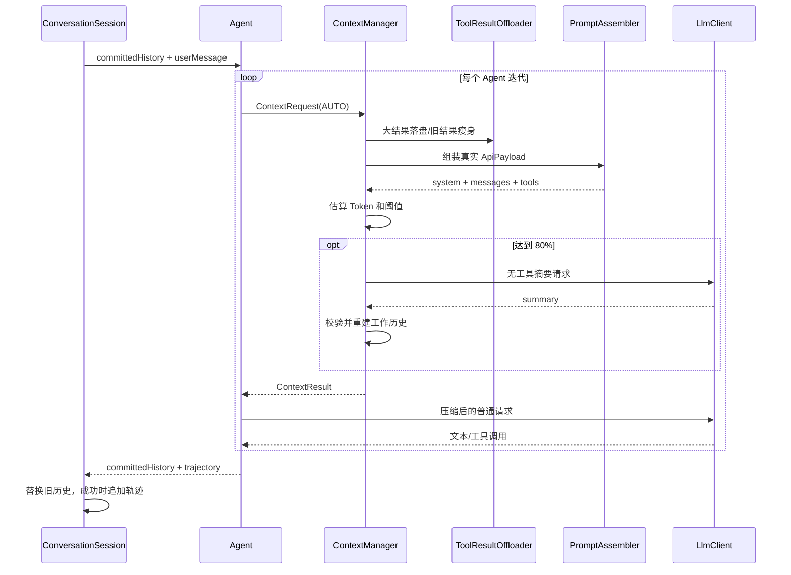

# ch8 上下文管理 Plan

## 架构概览

ch8 在现有 `conversation → agent → llm` 调用链之间加入独立的 `context` 领域模块。上下文模块不依赖终端，也不执行工具；它接收“已提交历史 + 当前任务轨迹 + 本轮提醒 + 工具可见性”，先对工具结果做本地落盘，再估算实际 API 载荷，必要时通过同一个 `LlmClient` 发起无工具摘要请求。

整体分为七个组件：

1. **ContextConfig**：承载上下文窗口和自动压缩阈值，接入现有 YAML/环境变量配置链。
2. **ApproximateTokenEstimator**：对 `ApiPayload`、消息块和工具定义做确定性近似估算。
3. **ToolResultOffloader**：执行单结果和累计结果两种第一层瘦身策略。
4. **ToolResultSpillStore**：在工作区安全目录中原子保存 UTF-8 工具结果。
5. **ConversationSummarizer**：使用专用 System Prompt、空工具集和同一个 LLM 生成结构化摘要。
6. **ContextManager**：统一驱动估算、第一层瘦身、第二层摘要和三次失败熔断。
7. **会话/Agent 集成**：Agent 每次迭代前调用 ContextManager；ConversationSession 负责最终历史替换和手动 `/compact`。

为保持失败轮次的事务语义，运行时上下文明确区分：

- `committedHistory`：进入本次用户任务前已提交的历史；压缩成功后允许独立回写。
- `trajectory`：当前用户任务内尚未提交的消息。
- `workingMessages`：实际发给下一次模型调用的压缩后组合视图。

摘要使用一个 `<summary>` 根节点，内部包含 `<prior_history>` 与 `<active_task>`。正常迭代使用两部分组合后的两条压缩消息；任务失败时只从 `<prior_history>` 重建已提交历史，不提交 `<active_task>`。

## 核心数据结构

### `ContextConfig`

```java
public record ContextConfig(
        int windowTokens,
        double autoCompactThreshold
) {
    public static final int DEFAULT_WINDOW_TOKENS = 64_000;
    public static final double DEFAULT_AUTO_COMPACT_THRESHOLD = 0.80;
}
```

配置入口：

```yaml
context:
  window-tokens: 64000
  auto-compact-threshold: 0.80
```

环境变量：

- `IMIO_CONTEXT_WINDOW_TOKENS`
- `IMIO_CONTEXT_AUTO_COMPACT_THRESHOLD`

窗口必须大于 `max-output-tokens`；阈值必须满足 `0 < value < 1`。

### `ContextPolicy`

固定本章策略常量，不暴露为运行时配置：

```java
public record ContextPolicy(
        double charsPerToken,
        int singleResultChars,
        int aggregateResultChars,
        int oldResultPreviewChars,
        int keepRecentToolIterations,
        int summaryOutputTokens,
        int maxConsecutiveFailures
) {
    public static ContextPolicy defaults();
}
```

默认值依次为 `3.5 / 5000 / 20000 / 2000 / 3 / 4096 / 3`。

### `ContextManageMode`

```java
public enum ContextManageMode {
    AUTO,
    FORCE,
    RECOVERY
}
```

- `AUTO`：第一层始终可运行，达到阈值才执行摘要。
- `FORCE`：手动 `/compact`，直接摘要，不以阈值为条件。
- `RECOVERY`：Provider 返回上下文超限后强制摘要；同一模型迭代最多一次。

### `ContextRequest`

```java
public record ContextRequest(
        List<ChatMessage> committedHistory,
        List<ChatMessage> trajectory,
        List<SystemReminder> reminders,
        ToolSelection toolSelection,
        int outputTokenLimit,
        ContextManageMode mode,
        AutoCompactTrackingState tracking
) {}
```

`committedHistory` 和 `trajectory` 保留事务边界；`reminders` 与 `toolSelection` 用于构造与真实调用一致的 `ApiPayload`。

### `ContextResult`

```java
public record ContextResult(
        List<ChatMessage> committedHistory,
        List<ChatMessage> trajectory,
        List<ChatMessage> workingMessages,
        long estimatedTokensBefore,
        long estimatedTokensAfter,
        int spilledResults,
        boolean compacted,
        ContextOutcome outcome
) {}
```

- `committedHistory`：失败时仍可安全回写的旧历史版本。
- `trajectory`：当前任务尚未提交的压缩后轨迹。
- `workingMessages`：下一次 API 请求直接使用的组合消息。
- `ContextOutcome`：`UNCHANGED / OFFLOADED / COMPACTED / FAILED / CIRCUIT_OPEN`。

### `AutoCompactTrackingState`

```java
public final class AutoCompactTrackingState {
    public int consecutiveFailures();
    public boolean circuitOpen();
    public void recordSuccess();
    public void recordFailure();
}
```

每次 `Agent.run` 新建，作用域只覆盖一个 Agent 任务。手动 `/compact` 使用独立状态。

### `CompactReport`

```java
public record CompactReport(
        boolean changed,
        long beforeTokens,
        long afterTokens,
        int spilledResults,
        String safeMessage
) {}
```

用于 `/compact` 返回可展示结果，不包含摘要正文或落盘内容。

### `ContextEvent`

```java
public sealed interface ContextEvent {
    record Started(ContextManageMode mode, long estimatedTokens) implements ContextEvent {}
    record ResultsOffloaded(int count, String directory) implements ContextEvent {}
    record Completed(ContextManageMode mode, long before, long after) implements ContextEvent {}
    record Failed(ContextManageMode mode, String safeMessage) implements ContextEvent {}
    record CircuitOpened(int consecutiveFailures) implements ContextEvent {}
}
```

`AgentEvent` 增加 `ContextChanged(ContextEvent event)` 包装事件，使 context 模块不反向依赖 agent 或 terminal。

## 模块设计

### 1. 配置模块

**职责：** 加载、验证上下文窗口和阈值。

**修改：**

- `ConfigDocument` 增加 `ContextDocument`。
- `AppConfig` 增加不可空 `ContextConfig context`。
- `ConfigLoader` 合并 YAML、环境变量和默认值，并验证窗口大于输出上限。
- 保留现有构造器重载，已有测试和调用方不需要一次性全部改写。

**验证：** 默认值、YAML、环境变量优先级、边界值、非法 double 与窗口不足测试。

### 2. 实际载荷 Token 估算

**职责：** 对真正将进入 Provider 的统一载荷做近似估算，而不是只统计纯文本历史。

```java
public final class ApproximateTokenEstimator {
    public long estimate(ApiPayload payload);
    public long estimateMessages(List<ChatMessage> messages);
}
```

算法规则：

- 字符 Token 使用 `ceil(chars / 3.5)`，以整数运算实现 `ceil(chars * 2 / 7)`。
- 每条消息、每个内容块增加固定结构开销。
- `TextPart` 计文本；`ThinkingPart` 计文本和元数据；`ToolCallPart` 计 ID、名称和参数 JSON；`ToolResultPart` 计 ID、名称、结果字段、输出和错误。
- 工具定义计名称、描述、风险和 Schema JSON。
- 估算 `ApiPayload.systemPrompt + messages + tools + outputTokenLimit`。
- 所有加法使用饱和运算，超过 `long` 范围时返回 `Long.MAX_VALUE`。

`ContextManager` 复用 `PromptAssembler.assembleApiPayload` 构造真实三通道载荷，因此环境/会话/轮次 reminder、当前工具选择和 System Prompt 都进入预算。

### 3. PromptAssembler 与摘要专用请求

**职责：** 让摘要请求使用独立稳定 System Prompt，同时不复制三个 Provider 的编码逻辑。

`ChatRequest` 增加：

```java
Optional<String> systemPromptOverride
```

普通构造器保持不变，默认 `Optional.empty()`。`PromptAssembler` 仅对内部摘要请求采用 override；普通 Agent 请求继续使用 ch5 的七模块 System Prompt。

摘要请求固定使用：

- `ToolSelection.only(Set.of())`，不输出工具 Schema。
- 空 reminders，避免环境和 Plan reminder 干扰摘要。
- `systemPromptOverride = SummaryPrompt.SYSTEM`。
- 输出上限为 `min(ContextPolicy.summaryOutputTokens, max-output-tokens)`。
- `LlmEventListener.NOOP`，不把摘要正文流式显示为聊天回复。

`LlmClientFactory` 增加接收共享 `PromptAssembler` 的重载。应用只创建一个 PromptAssembler，同时交给 Provider Client 和 ContextManager，避免预算载荷与真实载荷不一致。

### 4. 工具结果安全落盘

**职责：** 保存完整 ToolResult 内容，返回稳定占位结果。

```java
public final class ToolResultSpillStore {
    public SpilledResult spill(ToolResultPart part) throws IOException;
}

public record SpilledResult(
        String relativePath,
        long originalChars,
        String contentHash
) {}
```

写盘步骤：

1. 在工作区下验证或创建普通目录 `.imiocode/tool-results/`，逐段拒绝链接和重解析点。
2. 将调用 ID 清洗为 `[a-zA-Z0-9._-]`；空值回退 `tool-result`，限制长度。
3. 文件名使用 `<safe-id>-<sha256-prefix>.txt`，同内容得到同路径，不同内容不会覆盖。
4. 文件正文包含工具名、成功状态、元信息、原始 output 和 error 的明确分区。
5. 写入同目录临时文件，复检目录和目标，再以原子移动且不覆盖的方式发布。
6. 已存在且为普通文件时视为幂等成功；任何可疑类型都拒绝。

占位内容使用固定前缀 `[Tool result offloaded]`，包含预览、字符数、相对路径和 `read_file` 提示。成功结果把占位放在 output；失败结果把占位放在 error；其他元信息原样复制。

### 5. 第一层结果瘦身

**职责：** 不调用 LLM 地减少 ToolResultPart 体积。

```java
public final class ToolResultOffloader {
    public OffloadResult offload(List<ChatMessage> messages);
}
```

处理顺序：

1. 扫描全部 `ToolResultPart`，识别已有占位，不重复处理。
2. 对 output+error 大于 5,000 字符的单结果立即落盘。
3. 重新计算未落盘结果总量；若超过 20,000 字符，从旧到新处理。
4. 以最后 3 条 TOOL 消息作为“最近 3 个完整工具迭代”保护边界。
5. 批量落盘结果的会话预览最多保留 2,000 字符。
6. 只有成功写盘的结果才替换原消息；写盘失败保留原对象。

返回不可变新消息列表、成功落盘数量和安全错误计数。原消息列表不原地修改。

### 6. 会话序列化、摘要和解析

**职责：** 把 Provider 相关消息块转换成可总结文本，并严格验证摘要。

```java
public final class ConversationSerializer {
    public String serialize(
            List<ChatMessage> committedHistory,
            List<ChatMessage> trajectory);
}

public final class ConversationSummarizer {
    public SummaryResult summarize(ContextRequest request) throws LlmException;
}

public final class SummaryParser {
    public ParsedSummary parse(String text);
}
```

序列化格式使用明确的只读数据边界：

```xml
<conversation_data>
  <prior_history>...</prior_history>
  <active_task>...</active_task>
</conversation_data>
```

用户/工具内容中的 XML 字符必须转义，不能突破边界伪造控制标签。

摘要响应必须完整匹配：

```xml
<summary>
  <prior_history>...</prior_history>
  <active_task>...</active_task>
</summary>
```

解析器要求唯一根标签、两个唯一子标签、非空有效内容且根标签外只有空白。成功后构造：

- 工作上下文：一条包含两个摘要分区的 USER 消息 + 一条固定 ASSISTANT 确认。
- 可回写历史：仅包含 prior_history 的 USER 摘要消息 + 固定 ASSISTANT 确认；原 committedHistory 为空时保持空列表。

摘要消息带固定版本标记，后续压缩可识别并重新序列化，不把控制标签当成普通用户指令。

### 7. ContextManager 两层编排

**职责：** 统一实现 `ManageContext` 和 `ForceCompact` 行为。

```java
public final class ContextManager {
    public ContextResult manage(
            ContextRequest request,
            ContextEventListener listener) throws ContextException;

    public CompactReport forceCompact(
            List<ChatMessage> history,
            ContextEventListener listener) throws ContextException;
}
```

`AUTO` 流程：

1. 用当前请求组装 `ApiPayload` 并记录 before。
2. 执行 ToolResultOffloader；重新组装和估算。
3. 若总估算 `< floor(windowTokens * threshold)`，返回第一层结果。
4. 若 tracking 已熔断，返回 `CIRCUIT_OPEN` 第一层结果。
5. 调用 ConversationSummarizer 一次。
6. 校验摘要并重新估算；after 必须小于第一层估算。
7. 成功则 `recordSuccess`，失败则 `recordFailure` 并保留第一层结果。

`FORCE` 跳过阈值判断，空历史直接返回 no-op；仍验证摘要必须缩小上下文。

`RECOVERY` 跳过阈值判断，但由 Agent 的单迭代布尔标记保证最多执行一次。

摘要失败属于上下文管理失败，不直接清空 Agent 历史。AUTO 模式在未真正超出安全预算时可使用第一层结果继续；若仍达到或超过可发送上限，ContextManager 抛出安全、可恢复异常。

### 8. Agent Loop 状态与回写

**职责：** 在每次真实模型调用前使用压缩结果，并将可提交历史带回 ConversationSession。

`Agent` 增加 `ContextManager` 依赖。`run` 内维护 `ManagedConversationState`：

```java
final class ManagedConversationState {
    List<ChatMessage> committedHistory();
    List<ChatMessage> trajectory();
    List<ChatMessage> workingMessages();
    void apply(ContextResult result);
}
```

每次迭代顺序：

1. 将当前 reminders 与工具选择加入 ContextRequest。
2. `contextManager.manage(AUTO)`。
3. 把 ContextEvent 包装为 AgentEvent 发给 UI。
4. 用 `result.workingMessages()` 创建普通 ChatRequest。
5. 收集模型响应和工具结果，追加到 state 的 trajectory。
6. 若捕获 `LlmErrorType.CONTEXT_LIMIT` 且本迭代未恢复过，调用 `manage(RECOVERY)` 并重新执行该模型调用一次。

`AgentResult` 增加 `committedHistory` 字段。所有 completed/stopped/failed 结果都携带 ContextManager 最新确认可回写的 committedHistory。

`ConversationSession.sendWithEvents` 调整提交顺序：

1. Agent 返回后先以 `result.committedHistory()` 原子替换旧 history。
2. completed 时再追加完整 trajectory。
3. stopped/failed 时不追加 trajectory，再抛出原有 ConversationException。

这样自动摘要成功后下一轮立即生效；即使之后失败，也只保存 prior_history 摘要，不保存 active_task。

### 9. 手动 `/compact` 与 UI

**职责：** 提供串行、安全的用户入口。

`Agent` 增加：

```java
public CompactReport forceCompactHistory(
        List<ChatMessage> history,
        AgentEventListener listener);
```

活动任务存在时拒绝手动压缩；ConversationLoop 本身串行读取输入，因此正常终端路径不会并发发生。

`ConversationSession.forceCompact` 在同步块中：

1. 快照 history，但不消费 pending reminders。
2. 调用 Agent.forceCompactHistory。
3. 成功时一次性替换 history。
4. 返回 CompactReport。

`ConversationLoop` 在 `/plan`、`/do` 同级识别 `/compact`，设置 `UiState.COMPACTING`，处理 ContextChanged 事件并在完成/失败后回到 READY。

`TerminalUi` 增加 `showContextEvent` 与 `showCompactReport` 默认方法；`JLineTerminalUi` 输出前后 Token、节省比例、落盘数量和安全错误，不输出摘要正文。

### 10. Provider 上下文超限识别

**职责：** 将三个 Provider 的上下文超限统一映射为可恢复类型。

- `LlmErrorType` 增加 `CONTEXT_LIMIT`。
- Provider 错误体读取器内部提取 `code/type/message` 作为判别信号，但不将原始 message 暴露给 UI。
- `HttpErrorMapper` 识别已知的 `context_length_exceeded`、`prompt_too_long`、`maximum context length`、`too many input tokens` 等信号，返回统一安全文案。
- `LlmRetryPolicy` 不对 `CONTEXT_LIMIT` 做普通网络重试；只由 Agent ContextManager 恢复一次。
- 摘要请求自身发生 CONTEXT_LIMIT 时计为压缩失败，不能递归触发第二次摘要。

### 11. 工具目录扫描与 Git 忽略

- `.gitignore` 增加 `/.imiocode/tool-results/`。
- `WorkspaceWalker` 在发现该目录时不加入结果、不继续递归。
- `read_file` 仍允许按摘要占位给出的明确路径读取单个结果文件。
- 不跳过整个 `.imiocode`，只跳过工具结果目录，避免扩大行为变化。

## 模块交互

### 自动压缩



### 手动压缩

```mermaid
sequenceDiagram
    participant User
    participant Loop as ConversationLoop
    participant Session as ConversationSession
    participant Context as ContextManager
    participant LLM as LlmClient

    User->>Loop: /compact
    Loop->>Session: forceCompact()
    Session->>Context: FORCE + history snapshot
    Context->>LLM: 无工具摘要请求
    LLM-->>Context: structured summary
    Context-->>Session: CompactReport + new history
    Session->>Session: 成功后原子替换
    Session-->>Loop: before/after tokens
    Loop-->>User: 压缩结果
```

## 文件组织

```text
src/main/java/io/imiocode/
├── context/
│   ├── ApproximateTokenEstimator.java
│   ├── AutoCompactTrackingState.java
│   ├── CompactReport.java
│   ├── ContextEvent.java
│   ├── ContextEventListener.java
│   ├── ContextException.java
│   ├── ContextManageMode.java
│   ├── ContextManager.java
│   ├── ContextOutcome.java
│   ├── ContextPolicy.java
│   ├── ContextRequest.java
│   ├── ContextResult.java
│   ├── ConversationSerializer.java
│   ├── ConversationSummarizer.java
│   ├── OffloadResult.java
│   ├── ParsedSummary.java
│   ├── SpilledResult.java
│   ├── SummaryParser.java
│   ├── SummaryPrompt.java
│   ├── ToolResultOffloader.java
│   └── ToolResultSpillStore.java
├── config/
│   ├── ContextConfig.java                 # 新建
│   ├── AppConfig.java                     # 增加 context
│   ├── ConfigDocument.java                # 增加 ContextDocument
│   └── ConfigLoader.java                  # 合并和校验配置
├── conversation/
│   ├── ChatRequest.java                   # System Prompt override
│   ├── ConversationLoop.java              # /compact
│   └── ConversationSession.java           # 历史替换/手动压缩
├── agent/
│   ├── Agent.java                         # 每迭代管理和恢复
│   ├── AgentEvent.java                    # ContextChanged
│   ├── AgentResult.java                   # committedHistory
│   ├── ManagedConversationState.java       # 事务边界
│   └── StreamingTurnExecutor.java         # 保留 request override
├── llm/
│   ├── LlmClientFactory.java              # 共享 PromptAssembler
│   └── LlmErrorType.java                  # CONTEXT_LIMIT
├── llm/transport/HttpErrorMapper.java      # 超限识别
├── llm/provider/{anthropic,openai,deepseek}/*Client.java
│                                             # 错误判别信号
├── prompt/PromptAssembler.java             # override + 实际载荷复用
├── terminal/
│   ├── TerminalUi.java                     # context 展示接口
│   ├── JLineTerminalUi.java                # 压缩 UI
│   └── UiState.java                        # COMPACTING
├── tool/workspace/WorkspaceWalker.java     # 跳过结果目录
└── ImioCodeApplication.java                # 组装 ContextManager

src/test/java/io/imiocode/
├── context/
│   ├── ApproximateTokenEstimatorTest.java
│   ├── ContextManagerTest.java
│   ├── ConversationSerializerTest.java
│   ├── ConversationSummarizerTest.java
│   ├── SummaryParserTest.java
│   ├── ToolResultOffloaderTest.java
│   └── ToolResultSpillStoreTest.java
├── config/ConfigLoaderTest.java
├── agent/AgentContextManagementTest.java
├── conversation/ConversationCompactTest.java
├── llm/transport/HttpErrorMapperTest.java
├── prompt/PromptAssemblerTest.java
├── terminal/JLineTerminalUiTest.java
└── tool/workspace/WorkspaceWalkerTest.java

docs/ch8/
├── spec.md
├── plan.md
├── task.md
├── checklist.md
└── acceptance-report.md
```

同时修改 `.gitignore` 与 `README.md`，记录结果目录、配置项和 `/compact` 用法。

## Spec 覆盖映射

| Spec | 设计归属 |
|------|----------|
| F1 | ContextConfig + ConfigLoader |
| F2 | ApproximateTokenEstimator + PromptAssembler 真实载荷 |
| F3 | ToolResultSpillStore + ToolResultOffloader |
| F4 | ToolResultOffloader 最近迭代边界 |
| F5 | ConversationSummarizer + SummaryParser + ContextManager |
| F6 | ConversationSession.forceCompact + ConversationLoop |
| F7 | ManagedConversationState + AgentResult 历史回写 |
| F8 | AutoCompactTrackingState + CONTEXT_LIMIT 恢复 |
| F9 | ContextEvent + AgentEvent + TerminalUi |
| F10 | WorkspacePolicy/SpillStore + WorkspaceWalker + .gitignore |

没有未归属的功能需求。

## 技术决策

| 决策点 | 选择 | 理由 |
|--------|------|------|
| 压缩层次 | 本地落盘优先，LLM 摘要兜底 | 降低成本并避免不必要 API 请求 |
| 估算输入 | 估算 PromptAssembler 生成的 ApiPayload | 同时覆盖 System、reminders、messages、tools 和输出预留 |
| Token 公式 | `ceil(chars * 2 / 7)` + 固定结构开销 | 对应 3.5 chars/token，确定、快速、无浮点漂移 |
| 摘要调用 | 同一个 LlmClient + System Prompt override + 空工具集 | 复用 Provider 流式协议，同时不会进入 Agent Loop |
| 摘要结构 | prior_history + active_task 双分区 | 同时满足迭代压缩和失败时不提交未完成轨迹 |
| 历史更新 | AgentResult 携带 committedHistory，Session 先替换再按成功状态追加轨迹 | 保持外层历史与内部压缩结果一致 |
| 落盘命名 | 安全 ID + 内容 SHA-256 前缀 | 幂等、避免覆盖、抵抗恶意调用 ID |
| 落盘发布 | 同目录临时文件 + 原子不覆盖移动 | 防半文件和竞态覆盖 |
| 失败策略 | 成功后替换，失败保留上一可用版本 | 上下文管理不能造成历史丢失 |
| 熔断范围 | 每个 Agent 任务独立，连续 3 次 | 避免跨任务永久禁用，也防单任务死循环 |
| 超限错误 | 新增 CONTEXT_LIMIT，不复用 OUTPUT_LIMIT | 输入窗口超限与模型输出截断的恢复动作完全不同 |
| 工具目录可见性 | Glob/Walker 跳过，但 read_file 可明确读取 | 避免噪声扫描，同时保留按路径恢复全文能力 |
| 清理策略 | 本章不清理 | 摘要路径必须在后续轮次继续有效 |
