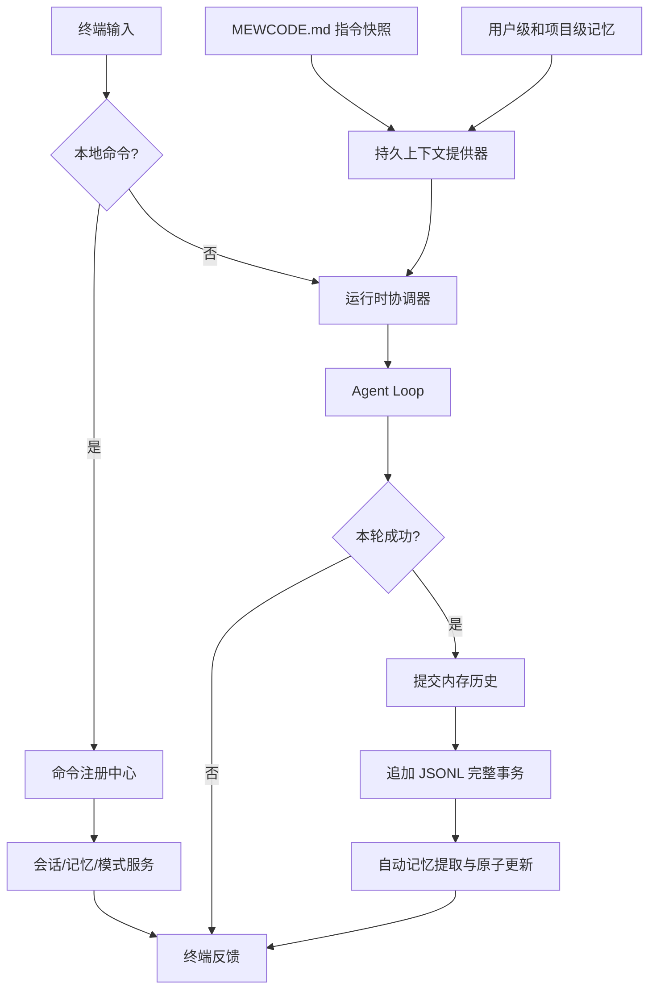
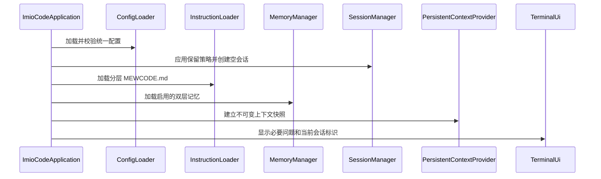
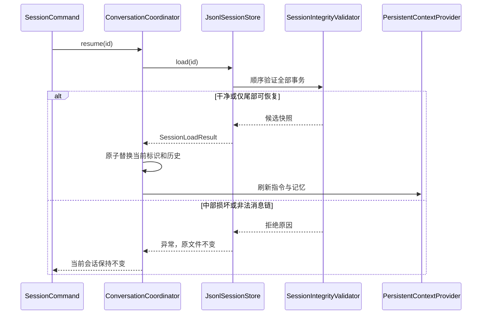

# CH9 跨会话记忆系统 Plan

## 架构概览

本章采用分层服务架构，将指令加载、会话持久化、长期记忆和本地命令拆成独立模块，由新增的运行时协调层统一编排。Agent、LLM Provider、工具、权限和上下文压缩保持原有职责，只通过既有消息提醒与会话历史入口接收新能力。

### 1. 指令上下文层

新增 `instruction` 模块，负责发现用户级与项目级 `MEWCODE.md`、安全展开 `@include`、执行范围和容量校验，并生成按低到高优先级排列的不可变指令快照。该模块不直接调用模型，也不修改 System Prompt；会话层在每轮请求前把快照转换成 SESSION 级 `SystemReminder`。

### 2. 会话持久化层

新增 `session` 模块，分为会话生命周期管理、JSONL 存储和消息编解码三部分。生命周期管理器维护当前会话的标识与元数据；存储层以仅追加事务记录保存完整轮次，并通过提交记录和校验摘要识别有效边界；消息编解码器完整保存 `ChatMessage` 的所有内容部件。恢复操作先在临时结果中完成校验，成功后才替换内存历史，避免损坏文件污染当前会话。

### 3. 长期记忆层

新增 `memory` 模块，负责用户级与项目级 `memories.md` 的解析、合并、原子写入和容量约束。自动提取器复用当前配置的 LLM 客户端，在 Agent 成功完成且会话已经持久化后执行一次无工具的结构化提取；安全过滤器只接受白名单类别，并拒绝秘密、敏感信息、临时状态和过大内容。提取失败通过事件反馈，但不回滚已成功的对话。

### 4. 持久上下文层

新增统一的会话上下文提供器，将指令快照、用户记忆和项目记忆按稳定顺序组装为 SESSION reminder。运行时协调器在调用 `ConversationSession` 前读取最新快照并传入一次性提醒，因此新记忆下一轮立即生效；这些提醒不进入可恢复历史，也不改变 `PromptAssembler` 已缓存的 System Prompt。

### 5. 本地命令层

新增 `command` 模块，提供命令解析器、注册中心、执行上下文和类型化处理器。运行时交互循环只负责读取输入和渲染结果，所有斜杠命令先交给本地命令层；新模块承载 `/session`、`/memory`，并接管现有 `/plan`、`/do`、`/compact`、UI 模式和退出命令，保持原有行为。会话切换与删除通过协调器暴露的命令服务接口执行，删除使用终端确认接口，任何本地命令都不会进入 Agent Loop。

### 6. 配置与应用装配层

配置模块新增 `InstructionsConfig`、`SessionsConfig` 和 `MemoryConfig`，由现有统一配置加载器完成默认值、YAML 映射和范围校验。应用入口根据工作目录、用户目录和配置装配上述服务，将共享 LLM 客户端交给 Agent、摘要器与记忆提取器，并维持单一关闭顺序，避免重复关闭资源。

### 7. 运行时数据流



关键顺序固定为：**Agent 成功 → 内存历史提交 → 会话持久化 → 自动记忆提取**。恢复顺序固定为：**读取原文件 → 完整性校验/尾部隔离 → 构造候选历史 → 原子替换当前会话状态**。

## 核心数据结构与接口

### 配置模型

```java
public record InstructionsConfig(
        boolean enabled,
        int maxIncludeDepth,
        long maxExpandedBytes) {
    public static InstructionsConfig defaults();
}

public record SessionsConfig(
        boolean enabled,
        int retentionDays,
        int maxSessions) {
    public static SessionsConfig defaults();
}

public record MemoryConfig(
        boolean enabled,
        boolean autoExtract,
        boolean userScopeEnabled,
        boolean projectScopeEnabled,
        int maxEntriesPerScope,
        int maxEntryChars,
        long maxFileBytes,
        int extractionOutputTokens) {
    public static MemoryConfig defaults();
}
```

`AppConfig` 在现有字段末尾增加以上三个配置对象，并保留已有重载构造器，使现有测试和调用方继续使用默认值。`ConfigDocument` 增加对应 YAML 文档结构；加载器负责拒绝负数、必需正数项中的零、互相矛盾或超过硬上限的配置；会话保留天数和数量允许用零表示关闭自动清理。

### 指令模型

```java
public enum InstructionScope { USER, PROJECT }

public record InstructionSource(
        Path path,
        InstructionScope scope,
        int priority,
        String expandedContent) {}

public record InstructionProblem(
        Path source,
        String safeMessage) {}

public record InstructionSnapshot(
        List<InstructionSource> sources,
        List<InstructionProblem> problems,
        long expandedBytes) {}

public record InstructionLoadRequest(
        Path workspace,
        Path userHome,
        InstructionsConfig config) {}

public interface InstructionLoader {
    InstructionSnapshot load(InstructionLoadRequest request);
}
```

`FileInstructionLoader` 负责定位 Git 根目录、逐级发现文件，并委托 `IncludeExpander` 递归展开引用。`IncludeExpander` 每次解析都携带允许根目录、当前递归栈、已累计字节数和最大深度；规范化路径与真实路径都必须位于允许根目录内。单个来源失败时记录 `InstructionProblem` 并排除该来源，不把半展开内容注入上下文，其他独立来源仍可使用。

### 会话身份、快照与存储接口

```java
public record SessionId(String value) {}

public record SessionMetadata(
        SessionId id,
        Instant createdAt,
        Instant updatedAt,
        String workspaceIdentity,
        long commitCount,
        int messageCount) {}

public record SessionSnapshot(
        SessionMetadata metadata,
        List<ChatMessage> history) {}

public record SessionSummary(
        SessionId id,
        Instant createdAt,
        Instant updatedAt,
        int messageCount) {}

public enum SessionRecoveryStatus {
    CLEAN,
    TAIL_RECOVERED
}

public record SessionLoadResult(
        SessionSnapshot snapshot,
        SessionRecoveryStatus status,
        Optional<Path> quarantinedTail,
        Optional<String> warning) {}

public interface SessionStore {
    SessionSnapshot create();
    void appendCommit(SessionSnapshot before, SessionSnapshot after);
    SessionLoadResult load(SessionId id);
    List<SessionSummary> list();
    void delete(SessionId id);
}
```

`JsonlSessionStore` 只接受经过格式校验的 `SessionId`，所有路径均由项目会话目录与标识拼接产生，不接受任意用户路径。`SessionManager` 在其上提供当前会话生命周期和保留策略：

```java
public final class SessionManager {
    public SessionSnapshot createNew();
    public SessionLoadResult load(SessionId id);
    public void commit(SessionSnapshot before, SessionSnapshot after);
    public List<SessionSummary> list();
    public void delete(SessionId id);
    public void applyRetention();
}
```

### JSONL 事务记录与消息编解码

每个会话文件第一行是 `SessionHeaderRecord`。后续每次提交由一条 `TransactionBeginRecord`、若干条 `MessageRecord` 和一条 `TransactionCommitRecord` 组成：

```java
public enum TransactionMode { APPEND, REPLACE }

public record SessionHeaderRecord(
        String type, int schemaVersion, String sessionId,
        String workspaceIdentity, Instant createdAt) {}

public record TransactionBeginRecord(
        String type, String transactionId, TransactionMode mode,
        int baseMessageCount) {}

public record MessageRecord(
        String type, String transactionId, int sequence,
        StoredMessage message) {}

public record TransactionCommitRecord(
        String type, String transactionId, int messageCount,
        long commitNumber, String sha256, Instant committedAt) {}
```

历史仅在尾部增加消息时使用 `APPEND`；自动压缩或手动 `/compact` 改写了既有历史时使用 `REPLACE`，并在该事务内写入完整新快照。`sha256` 基于事务开始记录与全部消息记录的规范 UTF-8 JSON 字节计算。恢复时只有开始记录、连续序号、消息数量、基础消息数和摘要全部匹配的事务才会生效。

`SessionMessageCodec` 在领域消息和无多态歧义的存储 DTO 间转换：

```java
public interface SessionMessageCodec {
    StoredMessage encode(ChatMessage message);
    ChatMessage decode(StoredMessage message);
}

public record StoredMessage(String role, List<StoredPart> parts) {}

public record StoredPart(
        String type,
        String text,
        JsonNode metadata,
        String callId,
        String toolName,
        JsonNode arguments,
        StoredToolResult toolResult) {}

public record StoredToolResult(
        boolean success,
        String output,
        String error,
        boolean truncated,
        long durationMillis,
        Integer exitCode) {}
```

`StoredPart.type` 只允许 `text`、`thinking`、`tool_call`、`tool_result`。思考元数据保留 Provider 类型与原字段；工具参数使用 JSON 树保存；未知类型、角色与部件不匹配、重复工具调用标识或无法对应的工具结果都会使消息链校验失败。

### 长期记忆模型与接口

```java
public enum MemoryScope { USER, PROJECT }

public enum MemoryCategory {
    PREFERENCE,
    PROJECT_FACT,
    DECISION
}

public record MemoryEntry(
        String id,
        MemoryCategory category,
        String content) {}

public record MemoryDocument(
        MemoryScope scope,
        List<MemoryEntry> entries) {}

public record MemoryCandidate(
        MemoryScope scope,
        MemoryCategory category,
        String content,
        Optional<String> replacesId) {}

public record MemoryExtractionResult(
        List<MemoryCandidate> candidates,
        List<String> warnings) {}

public interface MemoryStore {
    MemoryDocument load(MemoryScope scope);
    void replace(MemoryDocument document);
}

public interface MemoryExtractor {
    MemoryExtractionResult extract(
            ChatMessage userMessage,
            List<ChatMessage> completedTrajectory,
            List<MemoryDocument> currentMemory);
}
```

`MarkdownMemoryStore` 使用每行一条的可读格式：`- [<id>] [<category>] <content>`。作用域由文件位置决定，不在正文重复保存。`MemoryManager` 是手动命令和自动提取的共同入口：

```java
public final class MemoryManager {
    public List<MemoryDocument> loadEnabledScopes();
    public MemoryEntry add(MemoryScope scope, String content);
    public MemoryEntry edit(MemoryScope scope, String id, String content);
    public void forget(MemoryScope scope, String id);
    public MemoryUpdateReport applyCandidates(List<MemoryCandidate> candidates);
}
```

`MemorySafetyPolicy` 在写入前校验类别、作用域、长度、秘密模式和敏感信息模式；自动候选还必须通过白名单判定。`replacesId` 只能更新同作用域已有条目，不能删除；规范化内容完全相同时视为重复并跳过。`MarkdownMemoryStore.replace` 使用同目录临时文件、刷新写入并优先原子替换。

### 持久上下文与事件

```java
public interface PersistentContextProvider {
    List<SystemReminder> currentReminders();
    void reloadInstructions();
    void reloadMemories();
}

public sealed interface PersistenceEvent {
    record SessionSaved(SessionId id, long commitCount) implements PersistenceEvent {}
    record SessionRestored(SessionId id, int messageCount) implements PersistenceEvent {}
    record SessionTailRecovered(SessionId id, Path quarantinedTail) implements PersistenceEvent {}
    record MemoryUpdated(int added, int updated, int skipped) implements PersistenceEvent {}
    record Warning(String safeMessage) implements PersistenceEvent {}
}

@FunctionalInterface
public interface PersistenceEventListener {
    void onEvent(PersistenceEvent event);
}
```

`DefaultPersistentContextProvider` 以“用户指令 → 项目指令（从根到近）→ 用户记忆 → 项目记忆”的固定顺序生成独立 SESSION reminder。源文件无变化时输出字节级稳定；刷新失败时继续保留上一份有效快照并发出安全警告。

### 本地命令模型

```java
public record ParsedCommand(
        String name,
        List<String> arguments) {}

public enum CommandDisposition {
    HANDLED,
    EXIT_REQUESTED
}

public record CommandResult(
        CommandDisposition disposition,
        List<CommandMessage> messages) {}

public record CommandMessage(
        boolean error,
        String text) {}

public interface CommandServices {
    AgentMode mode();
    void switchMode(AgentMode mode);
    CompactReport compact();
    SessionSummary currentSession();
    List<SessionSummary> listSessions();
    SessionSummary newSession();
    SessionLoadResult resumeSession(SessionId id);
    void deleteSession(SessionId id);
    List<MemoryDocument> listMemories(Optional<MemoryScope> scope);
    MemoryEntry addMemory(MemoryScope scope, String content);
    MemoryEntry editMemory(MemoryScope scope, String id, String content);
    void forgetMemory(MemoryScope scope, String id);
}

public record CommandContext(
        CommandServices services,
        TerminalUi terminal) {}

public interface LocalCommand {
    String name();
    Set<String> aliases();
    String usage();
    CommandResult execute(CommandContext context, List<String> arguments);
}

public final class LocalCommandRegistry {
    public void register(LocalCommand command);
    public Optional<CommandResult> dispatch(String input, CommandContext context);
}
```

`CommandParser` 仅将首字符为 `/` 的输入识别为本地命令，支持空白分隔、单引号、双引号和反斜杠转义；引号未闭合或参数非法时返回安全的用法错误。注册中心按规范化名称与别名做精确匹配，不做模糊执行；未知命令显示提示而不发送给模型。

## 模块详细设计

### `io.imiocode.instruction`

**职责：** 发现、读取、展开并排序指令文件，输出不可变快照和安全问题列表。

**主要组件：**

- `FileInstructionLoader`：计算用户配置目录、项目根目录和工作目录之间的目录链；用户文件优先级最低，项目文件按根到近递增。
- `GitProjectLocator`：使用有限超时的 `git rev-parse --show-toplevel` 获取项目根；失败或非仓库时回退到工作目录，不阻塞启动。
- `IncludeExpander`：仅识别整行 include 指令；路径先做语法校验和规范化，再通过 `toRealPath()` 校验真实文件未通过符号链接逃逸。
- `InstructionReminderFormatter`：给每个来源附加作用域、相对来源和优先级说明，生成确定性 SESSION reminder 正文。

**失败策略：** 一个顶层来源的任意 include 失败时，该来源整体不生效并产生一条问题；其他来源继续加载。容量预算按最终成功来源累计，不能通过多个文件绕过总上限。

### `io.imiocode.session`

**职责：** 管理项目会话身份、仅追加日志、完整性验证、尾部恢复、元数据列表和保留策略。

**主要组件：**

- `SessionId`：生成不可预测、文件名安全的标识，并只接受固定小写字母数字格式；命令输入不得包含路径分隔符、点段或扩展名。
- `JsonlSessionStore`：在 `<project>/.imiocode/sessions/` 创建和追加 UTF-8 日志；每次事务提交后调用文件强制刷新，确保成功返回前数据交给操作系统持久化。
- `SessionMessageCodec`：显式映射所有消息部件和三类思考元数据，不依赖 Jackson 的运行时多态类型名，避免升级后无法读取旧数据。
- `SessionIntegrityValidator`：验证 schema 版本、事务状态机、序号、计数、SHA-256、角色顺序、工具调用标识及工具结果对应关系。
- `SessionMetadataReader`：只读取文件头和尾部提交元数据生成列表，不构造完整消息树；损坏文件以安全状态显示，不因单个文件阻断列表。
- `SessionManager`：创建、加载、提交、删除与清理过期会话。保留策略只删除超过期限或数量上限的非当前会话，并按更新时间从旧到新处理。

**事务选择：** 若提交前历史是提交后历史的完整前缀，则只记录新增消息并使用 `APPEND`；否则使用 `REPLACE` 写入完整新历史。自动上下文压缩和 `/compact` 都可能触发 `REPLACE`。

**损坏判定：**

1. 文件头损坏、未知 schema、首个事务损坏，或一个损坏事务之后仍出现其他完整记录，视为中部损坏并拒绝恢复。
2. 文件在最后一个有效提交之后结束于未完成事务，或最后一行无法完整解析，视为尾部损坏。
3. 尾部恢复先把原始后缀按字节写入同目录 `*.corrupt-<timestamp>`，刷新成功后再将主文件原子重写为有效前缀；任一步失败都保留原文件并拒绝恢复。

### `io.imiocode.memory`

**职责：** 解析和写入双层 Markdown 记忆，执行手动管理、自动提取、安全过滤、去重与更新。

**主要组件：**

- `MarkdownMemoryStore`：用户作用域映射到 `~/.imiocode/memories.md`，项目作用域映射到 `<project>/.imiocode/memories.md`；忽略空行和标题，只接受规范记忆条目，格式错误时保留原文件并报告。
- `MemoryManager`：按配置开启的作用域加载文档，统一执行 add/edit/forget 和自动候选应用；每次变更基于磁盘最新版本，在内存副本校验通过后整体原子替换。
- `LlmMemoryExtractor`：直接调用共享 `LlmClient`，使用专用稳定提取提示、`ToolSelection.only(Set.of())` 和独立输出上限，不经过 Agent Loop、不暴露工具。
- `MemoryResponseParser`：只接受 `<memories>...</memories>` 内的严格 JSON；未知字段、未知枚举、空内容和数量越界均作为提取失败处理，不尝试从普通模型文本猜测。
- `MemorySafetyPolicy`：复用 `SecretRedactor` 的模式，并补充凭据赋值、个人身份、临时状态和大段文本检测；自动候选必须属于三种白名单类别，手动命令仍受秘密与容量限制。
- `MemoryReminderFormatter`：先输出用户记忆，再输出项目记忆，并明确冲突时项目条目优先；条目按稳定标识排序，确保同一内容生成稳定文本。

**合并规则：** `replacesId` 指向同作用域现有条目时原 ID 保持不变并替换正文；没有替换目标时，对去空白、统一大小写后的正文做精确去重；自动提取不能删除条目。每个作用域独立原子更新，一个作用域失败不会破坏另一个作用域。

### `io.imiocode.persistence`

**职责：** 汇总指令和记忆快照，向会话提供稳定提醒，并把持久化状态变化转换为 UI 可消费事件。

`DefaultPersistentContextProvider` 在启动时加载一次指令和记忆；每个用户轮次开始时只检查候选文件与已展开依赖的大小、修改时间和真实路径指纹，指纹变化时才重载不可变快照。手动记忆变更或自动记忆成功后主动刷新记忆快照；检查不在 Token 流或 Agent 内部工具迭代中重复执行。

提醒输出采用四个明确区块：用户指令、项目指令、用户记忆、项目记忆。空区块不生成消息。所有正文先拒绝保留的 `<system-reminder>` 标签，随后交由现有 `SystemReminder` 统一包裹。

### `io.imiocode.command`

**职责：** 解析和执行所有本地斜杠命令，统一参数错误、帮助文本和 UI 返回方式。

**主要组件：**

- `CommandParser` 与 `LocalCommandRegistry`：完成词法解析、精确路由和未知命令拦截。
- `SessionCommand`：实现 `list/current/new/resume/delete`；`resume` 先完整加载候选快照，校验成功后才调用会话切换；删除当前会话被拒绝，用户需先 `/session new`。
- `MemoryCommand`：实现 `list/add/edit/forget`；变更成功后同步刷新持久上下文。
- `PlanCommand`、`DoCommand`、`CompactCommand`、`VerbosityCommand`、`ExitCommand`：迁移现有本地分支，保持现有用户命令和提示不变。

终端接口增加通用 `confirmAction(ConfirmationPrompt)`，只返回确认或拒绝，不复用权限规则或永久授权。`/session delete` 把会话标识和不可恢复提示交给该接口；拒绝时不执行任何文件操作。

### 现有模块改造

**`ConversationSession`：** 保持 Agent 单轮事务边界，不直接依赖指令、会话存储或记忆模块。仅增加空闲检查和受控历史替换入口，供已通过完整性校验的恢复快照使用；原有发送、模式、权限、取消和压缩行为保持不变。

**`ConversationCoordinator`：** 新增运行时协调器，包装 `ConversationSession` 并实现 `CommandServices`。它持有当前 `SessionSnapshot`、`SessionManager`、`PersistentContextProvider`、`MemoryExtractor`、`MemoryManager` 和持久化事件监听器。每轮先刷新持久上下文并添加提醒，再调用核心会话；成功后比较前后历史、写入会话、执行自动记忆并刷新上下文。新建、恢复、删除、手动记忆和压缩也统一在此处保持状态一致。

**`ConversationLoop`：** 移到运行时模块，删除逐个字符串判断的斜杠命令分支，改为先调用 `LocalCommandRegistry.dispatch`。非命令输入保持现有流式事件渲染；持久化事件转为简洁 UI 信息。命令在当前同步交互循环内运行，因此不会和 Agent 请求并发；协调器仍保留空闲检查作为第二道防线。

**`PromptAssembler`：** 无需修改三通道规则。持久上下文以 `AgentRequest.reminders` 中的 SESSION reminder 进入 messages，System Prompt 与工具 cache 规则保持不变。

**`ImioCodeApplication`：** 在创建 Agent 前装配配置、指令加载器、会话存储、记忆服务和持久上下文；共享 `LlmClient` 在 Agent 返回后串行用于记忆提取。应用仍只由 Agent/会话关闭一次客户端，记忆提取器不拥有客户端生命周期。

## 模块交互

### 启动与新会话



### 成功对话与自动记忆

```mermaid
sequenceDiagram
    participant Loop as ConversationLoop
    participant Session as ConversationCoordinator
    participant Context as PersistentContextProvider
    participant Core as ConversationSession/Agent
    participant Store as SessionManager
    participant Extractor as MemoryExtractor
    participant Memory as MemoryManager

    Loop->>Session: sendWithEvents(userInput)
    Session->>Context: currentReminders()
    Session->>Core: send(history + user + reminders)
    Core-->>Session: completed response 与新历史
    Session->>Store: commit(before, after)
    Store-->>Session: JSONL 已刷新
    Session->>Extractor: extract(user, trajectory, currentMemory)
    Extractor-->>Session: MemoryCandidate 列表
    Session->>Memory: 安全过滤、合并、原子更新
    Memory-->>Session: MemoryUpdateReport
    Session->>Context: reloadMemories()
    Session-->>Loop: 最终响应与持久化事件
```

会话落盘或自动记忆失败发生在模型文本已经流式展示之后，因此不会把成功回复改判为 Agent 失败：会话落盘失败时保留内存历史并显示高可见警告，同时跳过自动记忆；自动记忆失败时仅显示普通警告。下一轮仍可继续，但 UI 明确告知该轮可能无法跨进程恢复。

### 失败或取消的对话

Agent 未完成、用户取消或发生工具/模型错误时，不追加本轮用户消息和临时轨迹，不创建会话事务，也不触发自动记忆。上下文管理对旧历史产生的临时压缩结果不写入会话文件；下次恢复仍使用最后一个成功提交。

### 手动压缩

`/compact` 先保留压缩前快照。压缩成功后更新内存历史，再由会话存储比较前后历史并写入 `REPLACE` 事务；落盘失败时保留当前内存压缩结果并显示无法跨进程恢复的警告。压缩不触发自动记忆。

### 恢复会话



### 本地命令路由

所有 `/` 开头输入都由本地命令层消费。命令注册中心返回 `HANDLED` 时循环继续读取输入，返回 `EXIT_REQUESTED` 时执行现有安全关闭流程；未知命令和参数错误同样视为已消费，绝不回退成普通用户消息。

## 文件组织

```text
src/main/java/io/imiocode/
├── command/
│   ├── CommandContext.java
│   ├── CommandDisposition.java
│   ├── CommandMessage.java
│   ├── CommandParser.java
│   ├── CommandResult.java
│   ├── CommandServices.java
│   ├── LocalCommand.java
│   ├── LocalCommandRegistry.java
│   └── builtin/
│       ├── CompactCommand.java
│       ├── DoCommand.java
│       ├── ExitCommand.java
│       ├── MemoryCommand.java
│       ├── PlanCommand.java
│       ├── SessionCommand.java
│       └── VerbosityCommand.java
├── config/
│   ├── InstructionsConfig.java
│   ├── MemoryConfig.java
│   ├── SessionsConfig.java
│   ├── AppConfig.java                 — 接入三个运行时配置
│   ├── ConfigDocument.java            — 增加三个 YAML 文档段
│   └── ConfigLoader.java              — 默认值与范围校验
├── instruction/
│   ├── FileInstructionLoader.java
│   ├── GitProjectLocator.java
│   ├── IncludeExpander.java
│   ├── InstructionLoadRequest.java
│   ├── InstructionLoader.java
│   ├── InstructionProblem.java
│   ├── InstructionReminderFormatter.java
│   ├── InstructionScope.java
│   ├── InstructionSnapshot.java
│   └── InstructionSource.java
├── memory/
│   ├── LlmMemoryExtractor.java
│   ├── MarkdownMemoryStore.java
│   ├── MemoryCandidate.java
│   ├── MemoryCategory.java
│   ├── MemoryDocument.java
│   ├── MemoryEntry.java
│   ├── MemoryExtractionResult.java
│   ├── MemoryExtractor.java
│   ├── MemoryManager.java
│   ├── MemoryReminderFormatter.java
│   ├── MemoryResponseParser.java
│   ├── MemorySafetyPolicy.java
│   ├── MemoryScope.java
│   ├── MemoryStore.java
│   └── MemoryUpdateReport.java
├── persistence/
│   ├── DefaultPersistentContextProvider.java
│   ├── FileFingerprint.java
│   ├── PersistenceEvent.java
│   ├── PersistenceEventListener.java
│   └── PersistentContextProvider.java
├── runtime/
│   ├── ConversationCoordinator.java   — 跨模块事务编排与命令服务
│   └── ConversationLoop.java          — 本地命令路由与流式 UI 渲染
├── session/
│   ├── JsonlSessionStore.java
│   ├── SessionId.java
│   ├── SessionIntegrityValidator.java
│   ├── SessionLoadResult.java
│   ├── SessionManager.java
│   ├── SessionMessageCodec.java
│   ├── SessionMetadata.java
│   ├── SessionMetadataReader.java
│   ├── SessionRecoveryStatus.java
│   ├── SessionSnapshot.java
│   ├── SessionStore.java
│   ├── SessionSummary.java
│   └── record/
│       ├── MessageRecord.java
│       ├── SessionHeaderRecord.java
│       ├── StoredMessage.java
│       ├── StoredPart.java
│       ├── StoredToolResult.java
│       ├── TransactionBeginRecord.java
│       ├── TransactionCommitRecord.java
│       ├── TransactionMode.java
│       └── SessionRecordCodec.java
├── conversation/
│   └── ConversationSession.java       — 保持 Agent 单轮事务并支持受控历史替换
├── terminal/
│   ├── ConfirmationPrompt.java
│   ├── JLineTerminalUi.java           — 删除确认与新状态展示
│   └── TerminalUi.java
└── ImioCodeApplication.java           — 依赖装配和关闭顺序

src/test/java/io/imiocode/
├── command/                            — 解析、注册和命令集成测试
├── instruction/                        — 优先级、include 与沙箱测试
├── memory/                             — Markdown、过滤、提取与原子更新测试
├── persistence/                        — 指纹刷新和 reminder 稳定性测试
├── runtime/                            — 协调顺序、本地命令和失败隔离测试
├── session/                            — 编解码、事务、损坏恢复测试
├── conversation/                       — 核心会话历史替换与既有行为测试
└── Ch9ApplicationIT.java               — 应用装配与真实本地流程测试

docs/ch9/
├── spec.md
├── plan.md
├── task.md
└── checklist.md
```

`.gitignore` 增加 `.imiocode/sessions/` 与 `.imiocode/memories.md`，避免本地对话和自动记忆被意外提交；项目中的 `MEWCODE.md` 不忽略，允许团队按需纳入版本控制。

## 技术决策

| 决策点 | 选择 | 理由 |
|---|---|---|
| 指令注入通道 | 每轮使用 SESSION `SystemReminder` | 复用 CH5 已有消息通道，不污染稳定 System Prompt 和 Prompt Cache |
| 外部文件刷新 | 每轮开始做轻量文件指纹检查，变化时重载 | 满足下一轮生效，同时避免每个 Agent 迭代重复读取和展开 |
| include 失败隔离 | 顶层来源整体失败，其他来源继续 | 不注入半展开规则，同时避免一个可选文件阻断整个应用 |
| 会话日志格式 | 版本化 JSONL + begin/messages/commit 三段事务 | 可流式追加、可定位崩溃尾部，并能显式验证提交完整性 |
| 历史变更表示 | 普通轮次 `APPEND`，压缩或改写用 `REPLACE` | 兼顾常规空间效率和上下文压缩后的正确恢复 |
| 完整性摘要 | SHA-256 覆盖规范事务 JSON | 可检测截断和内容篡改，JDK 原生支持且无需新依赖 |
| 消息序列化 | 显式存储 DTO，不启用 Java 多态类名 | 数据格式稳定、安全，并能精确迁移 schema |
| 尾部修复 | 先保存后缀副本，再原子重写有效前缀 | 最大限度保留原始证据，任何修复失败都不覆盖源文件 |
| 会话列表 | 读取头部与尾部提交元数据，不完整反序列化历史 | 控制大量或长会话下的列表开销 |
| 当前会话删除 | 禁止直接删除，先新建或恢复其他会话 | 避免后续提交重新创建被删除文件或丢失活动状态 |
| 记忆存储 | 两个本地 Markdown 文件，每条一行且带稳定 ID | 人可读、可手工维护，不引入数据库，精确支持 edit/forget |
| 自动提取协议 | 同一 LLM 客户端、无工具请求、XML 边界内严格 JSON | 避免进入 Agent 循环，解析确定，且不新增 Provider 适配 |
| 自动提取顺序 | 会话持久化成功后才执行 | 确保记忆来源对应一个可恢复的成功轮次 |
| 记忆更新 | 每个作用域独立临时文件 + force + 原子替换 | 崩溃时保留旧文件，用户与项目记忆互不破坏 |
| 记忆去重 | 规范化精确匹配 + 显式 `replacesId` | 行为可解释，不偷偷引入语义搜索或 Embedding |
| 本地命令 | 统一解析器和注册中心接管全部 `/` 命令 | 新命令不继续扩大 `ConversationLoop` 分支，并保证未知命令不进入模型 |
| 并发模型 | 会话命令、Agent 和记忆提取在主交互流中串行 | 本章明确不需要并发，消除会话切换与提交竞态 |
| 资源所有权 | Agent/会话拥有并关闭共享 LLM 客户端 | 保持现有生命周期，记忆提取器只借用客户端，避免重复关闭 |
| 隐私默认值 | 会话和项目记忆目录默认加入 `.gitignore` | 降低聊天内容、偏好和本地项目事实被误提交的风险 |
| 独立功能开关 | 关闭指令时返回空指令快照；关闭会话时使用仅内存临时身份；关闭记忆时返回空记忆快照 | 三项能力互不强绑定，符合 F11 的独立工作要求 |

### 默认配置与硬边界

```yaml
instructions:
  enabled: true
  max-include-depth: 8
  max-expanded-bytes: 131072

sessions:
  enabled: true
  retention-days: 0       # 0 表示不按天自动删除
  max-sessions: 0         # 0 表示不按数量自动删除

memory:
  enabled: true
  auto-extract: false      # 需用户显式授权向当前 Provider 再次发送脱敏后的本轮文本
  user-scope-enabled: true
  project-scope-enabled: true
  max-entries-per-scope: 200
  max-entry-chars: 1000
  max-file-bytes: 262144
  extraction-output-tokens: 1024
```

自动保留策略默认关闭，避免未获用户明确配置便删除历史。实现仍设置不可配置硬上限：include 深度 32、指令展开 1 MiB、单作用域记忆 2000 条、单条 4000 字符、单记忆文件 2 MiB、提取输出 4096 Token；配置超过硬上限时启动失败并指出字段。

会话持久化被配置关闭时，`/session` 管理子命令明确提示功能已关闭，普通对话仍保存在当前进程内；此状态不是写入失败，因此不会阻止独立启用的自动记忆。记忆被关闭时不加载、不提取也不写入，但会话持久化和指令仍正常运行。

### Spec 覆盖映射

| Spec | 设计归属 |
|---|---|
| F1—F3 | `instruction` + `persistence` + SESSION reminder |
| F4—F6 | `session` + JSONL 事务 + 完整性校验与隔离 |
| F7—F9 | `memory` + 原子 Markdown 存储 + 安全策略 |
| F10 | `command` + 通用终端确认接口 |
| F11 | 三个配置记录 + `ConfigDocument`/`ConfigLoader` |
| F12 | `ConversationCoordinator` 事务顺序 + `PersistenceEvent` + 应用装配 |

依赖方向固定为：`runtime → command/conversation/session/memory/persistence`，`command → session/memory/terminal(接口)`，`persistence → instruction/memory`，`session/memory → conversation 模型`，`memory → llm/tool(仅 ToolSelection)`。核心 `conversation` 不反向依赖 CH9 模块，底层服务不依赖具体终端实现，因此不存在模块循环。
